# ЧЕРТЕЖИ

Документ описывает архитектуру SummumOS: программную модель 16-битной машины,
инструменты сборки гостевых программ, приложения и интерфейсы хоста.
SummumOS запускается как приложение хостовой ОС; CPU, память и устройства
реализованы программно. Схемы выполнены в формате Mermaid (`graph`) и встроены
прямо в документ: GitHub рендерит их нативно по блокам кода `mermaid`,
отдельные файлы-картинки не нужны. При добавлении или изменении модуля
соответствующую схему следует обновлять.

## Как открывать проект

Перед открытием проекта в редакторе **выключите автоматический анализатор
кода** (rust-analyzer / LSP). В проекте есть сгенерированные файлы на
десятки тысяч строк: `src/apps/chisla.rs` — 10 404 `if`-а, `kernel.asm`
почти две тысячи строк, а `tools/mktetris.rs` печатает ещё тысячи.
Анализатор разбирает их целиком и ест гигабайты: один раз он уже съел
6,6 ГБ и ядро убило rust-analyzer, второй раз — 8,9 ГБ и убило
zed-editor. Сборке анализатор не нужен: `./build.sh` и `cargo test`
работают без него. Если LSP всё-таки включён, исключите в его настройках
`src/apps/chisla.rs` и `target/` (`rust-analyzer.files.exclude`,
`file_scan_exclusions`) — и не открывайте сгенерированные файлы руками.

---

## Чертёж №1. Общая схема

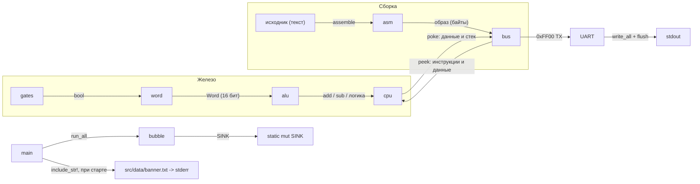
```mermaid
graph LR
    subgraph Железо
        gates["gates"] -->|bool| word["word"]
        word -->|"Word (16 бит)"| alu["alu"]
        alu -->|add / sub / логика| cpu["cpu"]
    end

    subgraph Сборка
        src["исходник (текст)"] -->|assemble| asm["asm"]
        asm -->|"образ (байты)"| bus
    end

    bus["bus"] -->|"peek: инструкции и данные"| cpu
    cpu -->|"poke: данные и стек"| bus
    bus -->|"0xFF00 TX"| uart["UART"]
    uart -->|write_all + flush| stdout["stdout"]

    main["main"] -->|run_all| bubble["bubble"]
    bubble -->|SINK| sink["static mut SINK"]
    main -->|"include_str!, при старте"| banner["src/data/banner.txt -> stderr"]
```

Стартовая надпись SummumOS хранится в `src/data/banner.txt` и встраивается через
`include_str!`. Консольная ветка выводит её в stderr, кроме режима `--play`;
оконный терминал рисует собственное приветствие. Готовый текстовый ресурс
не требует Python или генератора шрифтов при запуске.

## Чертёж №2. Слои железа

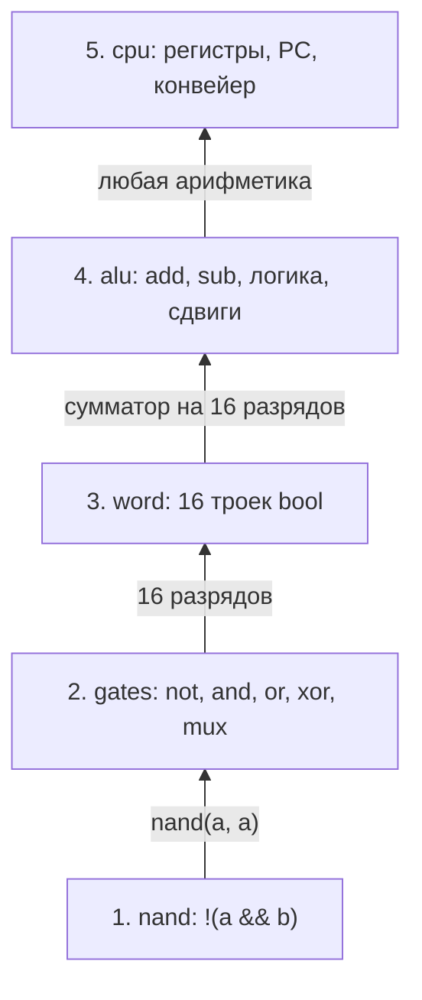
```mermaid
graph BT
    nand["1. nand: !(a && b)"]
    gates["2. gates: not, and, or, xor, mux"]
    word["3. word: 16 троек bool"]
    alu["4. alu: add, sub, логика, сдвиги"]
    cpu["5. cpu: регистры, PC, конвейер"]

    nand -->|"nand(a, a)"| gates
    gates -->|"16 разрядов"| word
    word -->|"сумматор на 16 разрядов"| alu
    alu -->|"любая арифметика"| cpu
```

Логические вентили, разрядные операции и арифметика ALU строятся из NAND:

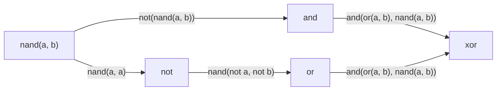
```mermaid
graph LR
    NAND["nand(a, b)"] -->|"nand(a, a)"| NOT["not"]
    NAND -->|"not(nand(a, b))"| AND["and"]
    NOT -->|"nand(not a, not b)"| OR["or"]
    AND -->|"and(or(a, b), nand(a, b))"| XOR["xor"]
    OR -->|"and(or(a, b), nand(a, b))"| XOR
```

Один разряд сумматора (`full_adder`, на выходе пара «перенос, сумма»):

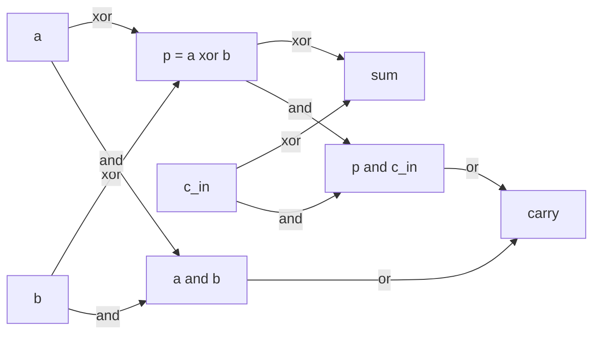
```mermaid
graph LR
    a["a"] -->|"xor"| p["p = a xor b"]
    b["b"] -->|"xor"| p
    p -->|"xor"| sum["sum"]
    cin["c_in"] -->|"xor"| sum
    a -->|"and"| g["a and b"]
    b -->|"and"| g
    p -->|"and"| t["p and c_in"]
    cin -->|"and"| t
    g -->|"or"| carry["carry"]
    t -->|"or"| carry
```

16 таких блоков подряд, перенос идёт по цепочке от младшего бита к старшему. Это `alu::add`.

## Чертёж №3. Карта памяти

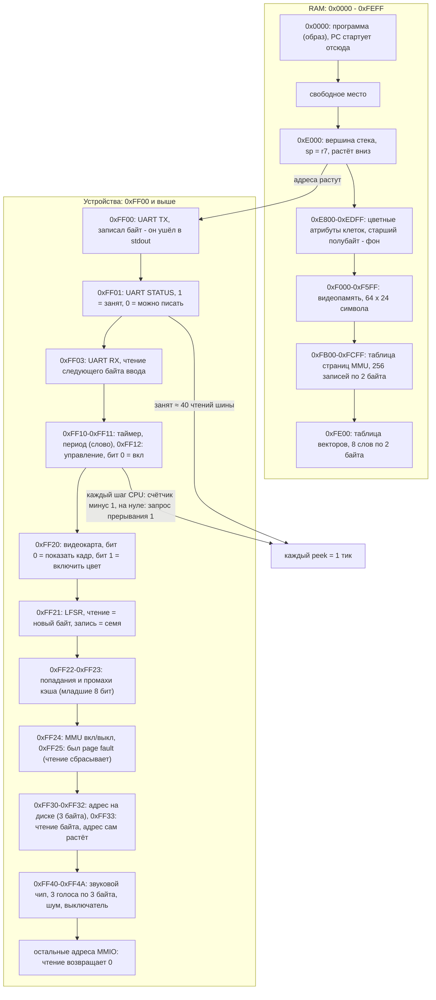
```mermaid
graph TB
    subgraph RAM["RAM: 0x0000 - 0xFEFF"]
        prog["0x0000: программа (образ), PC стартует отсюда"]
        free["свободное место"]
        stack["0xE000: вершина стека, sp = r7, растёт вниз"]
        attr["0xE800-0xEDFF: цветные атрибуты клеток, старший полубайт - фон"]
        vram["0xF000-0xF5FF: видеопамять, 64 x 24 символа"]
        pt["0xFB00-0xFCFF: таблица страниц MMU, 256 записей по 2 байта"]
        vt["0xFE00: таблица векторов, 8 слов по 2 байта"]
        prog --> free --> stack --> attr --> vram --> pt --> vt
    end

    subgraph MMIO["Устройства: 0xFF00 и выше"]
        tx["0xFF00: UART TX, записал байт - он ушёл в stdout"]
        st["0xFF01: UART STATUS, 1 = занят, 0 = можно писать"]
        rx["0xFF03: UART RX, чтение следующего байта ввода"]
        vid["0xFF20: видеокарта, бит 0 = показать кадр, бит 1 = включить цвет"]
        rng["0xFF21: LFSR, чтение = новый байт, запись = семя"]
        cac["0xFF22-0xFF23: попадания и промахи кэша (младшие 8 бит)"]
        mmu["0xFF24: MMU вкл/выкл, 0xFF25: был page fault (чтение сбрасывает)"]
        disk["0xFF30-0xFF32: адрес на диске (3 байта), 0xFF33: чтение байта, адрес сам растёт"]
        psg["0xFF40-0xFF4A: звуковой чип, 3 голоса по 3 байта, шум, выключатель"]
        tm["0xFF10-0xFF11: таймер, период (слово), 0xFF12: управление, бит 0 = вкл"]
        rest["остальные адреса MMIO: чтение возвращает 0"]
        tx --> st --> rx --> tm --> vid --> rng --> cac --> mmu --> disk --> psg --> rest
    end

    stack -->|"адреса растут"| tx
    st -->|"занят ≈ 40 чтений шины"| tick["каждый peek = 1 тик"]
    tm -->|"каждый шаг CPU: счётчик минус 1, на нуле: запрос прерывания 1"| tick
```

Время считается так: каждое чтение шины (`peek`) это один тик. Байт в UART занимает
передатчик на 40 тиков, программа ждёт в цикле `wait`.

## Чертёж №4. Формат инструкции (4 байта)

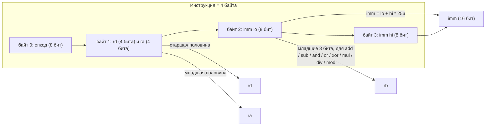
```mermaid
graph LR
    subgraph ins["Инструкция = 4 байта"]
        b0["байт 0: опкод (8 бит)"]
        b1["байт 1: rd (4 бита) и ra (4 бита)"]
        b2["байт 2: imm lo (8 бит)"]
        b3["байт 3: imm hi (8 бит)"]
        b0 --> b1 --> b2 --> b3
    end

    b2 -->|"imm = lo + hi * 256"| imm["imm (16 бит)"]
    b3 --> imm
    b2 -->|"младшие 3 бита, для add / sub / and / or / xor / mul / div / mod"| rb["rb"]
    b1 -->|"старшая половина"| rd["rd"]
    b1 -->|"младшая половина"| ra["ra"]
```

Регистры: `r0`…`r7`. `r7` это тоже `sp`.

## Чертёж №5. Последовательность стадий CPU

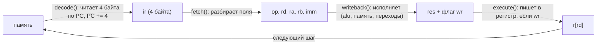
```mermaid
graph LR
    mem["память"] -->|"decode(): читает 4 байта по PC, PC += 4"| ir["ir (4 байта)"]
    ir -->|"fetch(): разбирает поля"| fields["op, rd, ra, rb, imm"]
    fields -->|"writeback(): исполняет (alu, память, переходы)"| res["res + флаг wr"]
    res -->|"execute(): пишет в регистр, если wr"| reg["r[rd]"]
    reg -->|"следующий шаг"| mem
```

Методы стадий вызываются последовательно в пределах одного шага CPU.
Их фактические операции указаны на схеме; названия методов сохраняются как в коде.

Условный переход (`jz`, `jnz`):

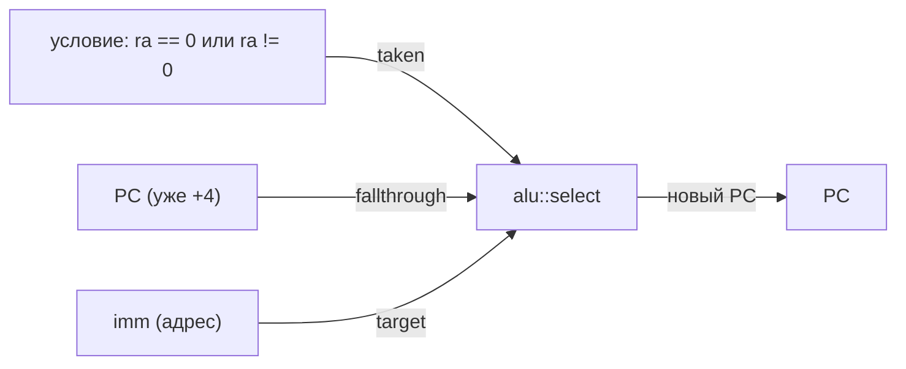
```mermaid
graph LR
    cond["условие: ra == 0 или ra != 0"] -->|"taken"| sel["alu::select"]
    pc["PC (уже +4)"] -->|"fallthrough"| sel
    imm["imm (адрес)"] -->|"target"| sel
    sel -->|"новый PC"| out["PC"]
```

## Чертёж №6. Таблица инструкций

| код | мнемоника | формат | что делает |
|---|---|---|---|
| 0 | `nop` | — | ничего |
| 1 | `ldi rd, imm` | rd, imm | rd = imm |
| 2 | `mov rd, ra` | rd, ra | rd = ra |
| 3 | `add rd, ra, rb` | rd, ra, rb | rd = ra + rb |
| 4 | `sub rd, ra, rb` | rd, ra, rb | rd = ra − rb |
| 5 | `and rd, ra, rb` | rd, ra, rb | rd = ra & rb |
| 6 | `or rd, ra, rb` | rd, ra, rb | rd = ra \| rb |
| 7 | `xor rd, ra, rb` | rd, ra, rb | rd = ra ^ rb |
| 8 | `shl rd, ra, n` | rd, ra, imm | сдвиг влево на n (0–15) |
| 9 | `shr rd, ra, n` | rd, ra, imm | сдвиг вправо на n |
| 10 | `ldb rd, [ra+imm]` | rd, ra, imm | байт из памяти |
| 11 | `stb [ra+imm], rs` | rs, ra, imm | байт в память |
| 12 | `ld rd, [ra+imm]` | rd, ra, imm | слово (2 байта, младший первым) |
| 13 | `st [ra+imm], rs` | rs, ra, imm | слово в память |
| 14 | `jmp imm` | imm | PC = imm |
| 15 | `jz ra, imm` | ra, imm | если ra == 0, PC = imm |
| 16 | `jnz ra, imm` | ra, imm | если ra != 0, PC = imm |
| 17 | `call imm` | imm | push PC, PC = imm |
| 18 | `ret` | — | pop PC |
| 19 | `push rd` | rd | sp −= 2, [sp] = rd |
| 20 | `pop rd` | rd | rd = [sp], sp += 2 |
| 21 | `hlt` | — | стоп |
| 22 | `addi rd, ra, imm` | rd, ra, imm | rd = ra + imm |
| 23 | `cmp rd, ra` | rd, ra | флаги Z, N, C от rd − ra |
| 24 | `cmpi rd, imm` | rd, imm | флаги Z, N, C от rd − imm |
| 25 | `je imm` | imm | если Z, PC = imm |
| 26 | `jne imm` | imm | если не Z, PC = imm |
| 27 | `jlt imm` | imm | если не C (меньше, без знака), PC = imm |
| 28 | `jge imm` | imm | если C (больше или равно, без знака), PC = imm |
| 29 | `mul rd, ra, rb` | rd, ra, rb | rd = ra * rb (младшие 16 бит) |
| 30 | `div rd, ra, rb` | rd, ra, rb | rd = ra / rb, деление на 0: прерывание 0 |
| 31 | `mod rd, ra, rb` | rd, ra, rb | rd = ra % rb, деление на 0: прерывание 0 |
| 32 | `int n` | imm | программное прерывание n (0–7) |
| 33 | `iret` | — | pop флаги, pop PC |
| 34 | `sti` | — | разрешить прерывания |
| 35 | `cli` | — | запретить прерывания |

## Чертёж №7. Ассемблер

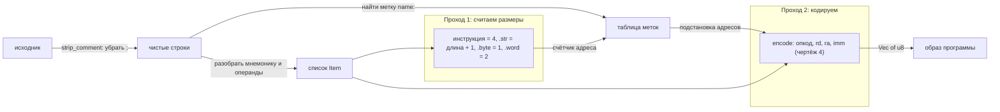
```mermaid
graph LR
    src["исходник"] -->|"strip_comment: убрать ;"| clean["чистые строки"]
    clean -->|"найти метку name:"| labels["таблица меток"]
    clean -->|"разобрать мнемонику и операнды"| items["список Item"]

    subgraph pass1["Проход 1: считаем размеры"]
        sz["инструкция = 4, .str = длина + 1, .byte = 1, .word = 2"]
    end

    items --> sz
    sz -->|"счётчик адреса"| labels

    subgraph pass2["Проход 2: кодируем"]
        enc["encode: опкод, rd, ra, imm (чертёж 4)"]
    end

    labels -->|"подстановка адресов"| enc
    items --> enc
    enc -->|"Vec of u8"| img["образ программы"]
```

Директивы: `.str "текст\n"` (в конце добавляется нулевой байт), `.byte 1, 2, 3`, `.word 0x1234, метка`.
Escape-последовательности: `\n \r \t \e \0 \\ \"`.
Числа: `42`, `0xFF`, `'A'`, `-1`. Операнд памяти: `[r1]` или `[r1+4]`.

## Чертёж №8. Вычислительный модуль `bubble`

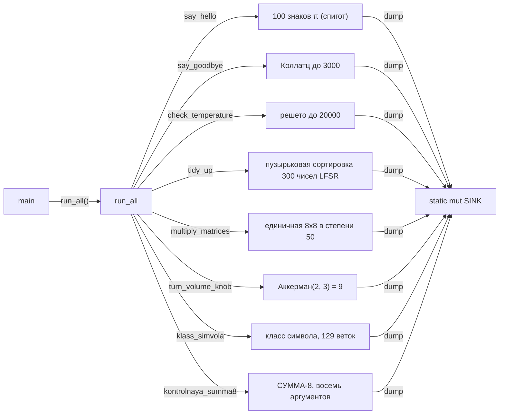
```mermaid
graph LR
    main["main"] -->|"run_all()"| run["run_all"]

    run -->|"say_hello"| pi["100 знаков π (спигот)"]
    run -->|"say_goodbye"| col["Коллатц до 3000"]
    run -->|"check_temperature"| sieve["решето до 20000"]
    run -->|"tidy_up"| sort["пузырьковая сортировка 300 чисел LFSR"]
    run -->|"multiply_matrices"| mat["единичная 8x8 в степени 50"]
    run -->|"turn_volume_knob"| ack["Аккерман(2, 3) = 9"]
    run -->|"klass_simvola"| klass["класс символа, 129 веток"]
    run -->|"kontrolnaya_summa8"| summa["СУММА-8, восемь аргументов"]

    pi -->|dump| sink["static mut SINK"]
    col -->|dump| sink
    sieve -->|dump| sink
    sort -->|dump| sink
    mat -->|dump| sink
    ack -->|dump| sink
    klass -->|dump| sink
    summa -->|dump| sink

```

`bubble::run_all` выполняет набор вычислительных процедур в консольной ветке
`main`. Результаты сохраняются в `static mut SINK` и не используются гостевой
программой. Тесты модуля проверяют в том числе первые 100 знаков числа π.

| функция | операция |
|---|---|
| `say_hello` | вычисление 100 знаков числа π алгоритмом spigot |
| `say_goodbye` | поиск самой длинной цепочки Коллатца до 3000 |
| `check_temperature` | подсчёт простых чисел до 20000 решетом Эратосфена |
| `tidy_up` | пузырьковая сортировка 300 чисел из LFSR |
| `multiply_matrices` | 50 умножений единичной матрицы 8×8 на единичную |
| `turn_volume_knob` | вычисление функции Аккермана для (2, 3), результат 9 |
| `klass_simvola` | классификация ASCII 32..126 через `match` |
| `kontrolnaya_summa8` | контрольная сумма восьми байтов; повторное вычисление не влияет на результат |
| `run_all` | последовательный вызов перечисленных процедур |

## Чертёж №9. Прерывания и таймер

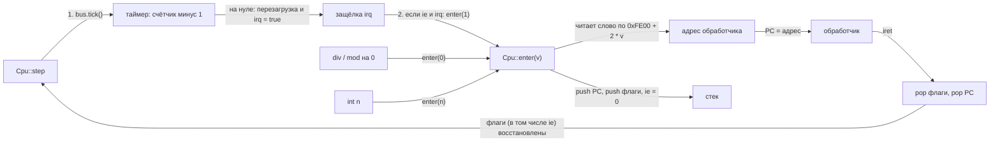
```mermaid
graph LR
    step["Cpu::step"] -->|"1. bus.tick()"| timer["таймер: счётчик минус 1"]
    timer -->|"на нуле: перезагрузка и irq = true"| irq["защёлка irq"]
    irq -->|"2. если ie и irq: enter(1)"| enter["Cpu::enter(v)"]
    div0["div / mod на 0"] -->|"enter(0)"| enter
    soft["int n"] -->|"enter(n)"| enter

    enter -->|"читает слово по 0xFE00 + 2 * v"| vec["адрес обработчика"]
    enter -->|"push PC, push флаги, ie = 0"| stack["стек"]
    vec -->|"PC = адрес"| handler["обработчик"]
    handler -->|iret| ret["pop флаги, pop PC"]
    ret -->|"флаги (в том числе ie) восстановлены"| step
```

Если вектор равен нулю, процессор паникует: «нет обработчика прерывания».
Векторы: 0 — деление на ноль, 1 — таймер, 5 — ошибка отображения страницы MMU;
остальные доступны для программных прерываний `int`.
Флаги в слове (младшие биты): Z, N, C, IE.

Сравнение: `cmp a, b` считает a + NOT b + 1. Перенос C = 1 означает «a больше или равно b» (без знака),
поэтому `jlt` прыгает, когда C = 0.

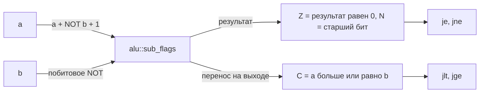
```mermaid
graph LR
    a["a"] -->|"a + NOT b + 1"| sum["alu::sub_flags"]
    b["b"] -->|"побитовое NOT"| sum
    sum -->|"результат"| zn["Z = результат равен 0, N = старший бит"]
    sum -->|"перенос на выходе"| c["C = a больше или равно b"]
    zn --> je["je, jne"]
    c --> jlt["jlt, jge"]
```

## Чертёж №10. Видео: от файла до терминала


```mermaid
graph LR
    asc["ASC-файл (текстовые кадры)"] -->|"main --pack: цепочки одинаковых символов и звук после каждого кадра"| bav["badapple.bav (видео и PSG-звук)"]
    bav -->|"bus.attach_disk"| disk["диск 0xFF33"]
    disk -->|"ldb: байт и адрес + 1"| player["плеер на ассемблере"]
    player -->|"пары: сколько, каким символом"| fill["цикл fill"]
    fill -->|"stb в 0xF000 и дальше"| vram["видеопамять"]
    player -->|"кадр собран: 1 в 0xFF20"| vid["Bus::present"]
    vram --> vid
    vid -->|"ANSI: курсор в начало + 24 строки"| out["stdout"]
    vid -->|"пауза до следующего кадра, 15 fps"| out
```

Формат BAV2:

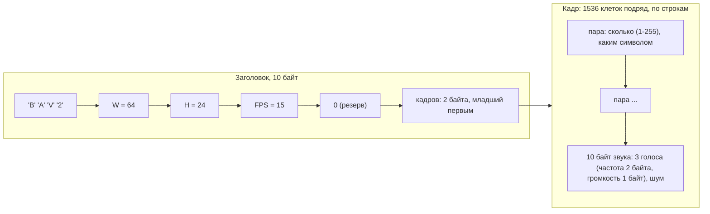
```mermaid
graph LR
    subgraph head["Заголовок, 10 байт"]
        h0["'B' 'A' 'V' '2'"]
        h1["W = 64"]
        h2["H = 24"]
        h3["FPS = 15"]
        h4["0 (резерв)"]
        h5["кадров: 2 байта, младший первым"]
        h0 --> h1 --> h2 --> h3 --> h4 --> h5
    end
    subgraph frame["Кадр: 1536 клеток подряд, по строкам"]
        r0["пара: сколько (1-255), каким символом"]
        r1["пара ..."]
        r2["10 байт звука: 3 голоса (частота 2 байта, громкость 1 байт), шум"]
        r0 --> r1 --> r2
    end
    h5 --> frame
```

Кадры идут подряд, сразу после заголовка. Пары повторяются, пока не наберётся 1536 клеток,
потом идут 10 байт звука, после этого кадр показывается. Запуск: `helloos --pack assets/badapple.asc assets/badapple.bav assets/badapple.snd`,
потом `helloos --play assets/badapple.bav`. Без пути `--play` использует вшитую версию 64×24.

Формат BAV4 (цветное видео терминального плеера, чертёж №19):

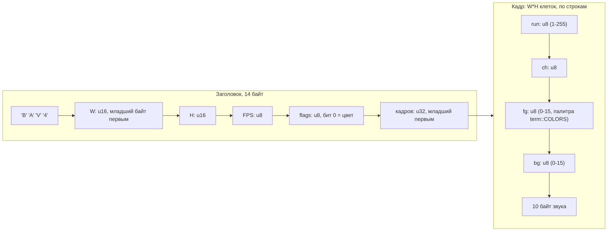
```mermaid
graph LR
    subgraph head4["Заголовок, 14 байт"]
        q0["'B' 'A' 'V' '4'"]
        q1["W: u16, младший байт первым"]
        q2["H: u16"]
        q3["FPS: u8"]
        q4["flags: u8, бит 0 = цвет"]
        q5["кадров: u32, младший первым"]
        q0 --> q1 --> q2 --> q3 --> q4 --> q5
    end
    subgraph frame4["Кадр: W*H клеток, по строкам"]
        c0["run: u8 (1-255)"]
        c1["ch: u8"]
        c2["fg: u8 (0-15, палитра term::COLORS)"]
        c3["bg: u8 (0-15)"]
        c4["10 байт звука"]
        c0 --> c1 --> c2 --> c3 --> c4
    end
    q5 --> frame4
```

Если бит 0 в `flags` сброшен, тело кадра содержит пары `run, ch`,
а цвет плеер назначает по символу. BAV2 и BAV3 читаются без изменений и тоже получают
синтезированный цвет. Цветной BAV4 собирает `tools/mkcolorvideo.rs`:
`ffmpeg -ss ... -t ... -vf fps=...,scale=W:H:flags=area,format=rgb24` даёт
RGB-кадры, каждая клетка усредняется в один пиксель (scale уже свёл кадр к W×H),
квантуется в ближайший из 16 цветов, яркость выбирает символ из ramp без `@`
(`@` в шрифте похож на `Q`), тёмные клетки остаются пробелом. В рантайме ffmpeg нет.

Управление прямо во время показа: пробел — пауза, `m` — звук вкл/выкл, `q` — выход (Ctrl+C тоже выйдет).
Консоль в этот момент сырая (через `stty raw -echo`), без неё — Enter после буквы; клавиши читает
отдельный поток, чтобы эмуляция не вставала. Во время паузы шаги CPU не выполняются. При продолжении расписание кадров
сбрасывается через `Bus::retime`, чтобы исключить ускоренный показ пропущенных интервалов.

## Чертёж №11. Звук

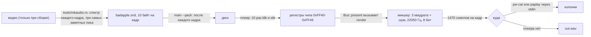
```mermaid
graph LR
    mp4["видео (только при сборке)"] -->|"tools/mkaudio.rs: спектр каждого кадра, три самых заметных пика"| snd["badapple.snd, 10 байт на кадр"]
    snd -->|"main --pack: после каждого кадра"| bav["диск"]
    bav -->|"плеер: 10 раз ldb и stb"| regs["регистры чипа 0xFF40-0xFF49"]
    regs -->|"Bus::present вызывает render"| mixer["микшер: 3 квадрата + шум, 22050 Гц, 8 бит"]
    mixer -->|"1470 сэмплов на кадр"| sink{"куда"}
    sink -->|"pw-cat или paplay через stdin"| ears["колонки"]
    sink -->|"плеера нет"| wav["out.wav"]
```

Звук привязан к кадрам: один кадр видео равен 1470 сэмплам звука (22050 / 15). Так задаётся соотношение длительностей видео и синтезированного аудио;
фактическое воспроизведение также зависит от буферизации хостового аудиовыхода.
Громкость между кадрами плавно переходит, чтобы не щёлкало. Переменная `HELLO_AUDIO`: `off`, `wav`, `pipe`, по умолчанию `auto`.
В сборке тестов (`cfg(test)`) `Bus::open_audio` не открывает аудиовыход;
при обычном запуске `HELLO_AUDIO=off` также отключает его. В обоих случаях
не запускаются `pw-cat`/`paplay` и не создаётся `out.wav`.
Сам `build.sh` вызывает сборку нативного Doom и `cargo build --release`: он
компилирует и линкует программы, но не запускает воспроизведение или тесты.

Регистры чипа:

| адрес | что |
|---|---|
| 0xFF40, 0xFF41 | голос 0: частота в Гц (младший, старший) |
| 0xFF42 | голос 0: громкость 0-15 |
| 0xFF43-0xFF45 | голос 1: то же |
| 0xFF46-0xFF48 | голос 2: то же |
| 0xFF49 | шум: громкость 0-15 |
| 0xFF4A | главный выключатель, бит 0 |

## Чертёж №12. Интерпретатор Lua

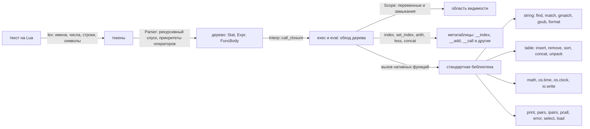
```mermaid
graph LR
    text["текст на Lua"] -->|"lex: имена, числа, строки, символы"| toks["токены"]
    toks -->|"Parser: рекурсивный спуск, приоритеты операторов"| ast["дерево: Stat, Expr, FuncBody"]
    ast -->|"Interp::call_closure"| exec["exec и eval: обход дерева"]
    exec -->|"Scope: переменные и замыкания"| env["область видимости"]
    exec -->|"index, set_index, arith, less, concat"| meta["метатаблицы: __index, __add, __call и другие"]
    exec -->|"вызов нативных функций"| lib["стандартная библиотека"]
    lib --> str["string: find, match, gmatch, gsub, format"]
    lib --> tbl["table: insert, remove, sort, concat, unpack"]
    lib --> mth["math, os.time, os.clock, io.write"]
    lib --> bas["print, pairs, ipairs, pcall, error, select, load"]
```

Строки хранятся как байты. Числа это `f64`, целые печатаются без `.0`. Шаблоны Lua (`%a`, `%d`, `[...]`, `*`, `+`, `-`, `?`, `%b`, `%f`, захваты) написаны своим сопоставителем.
Не умеет: корутины, `goto`, раздельные целые и дробные числа, `os.exit`, `io.read`, `require`.
Запуск скрипта: `helloos --lua файл.lua`. Интерпретатор работает в потоке с большим стеком (512 МБ).

## Чертёж №13. От C до Hello, World!

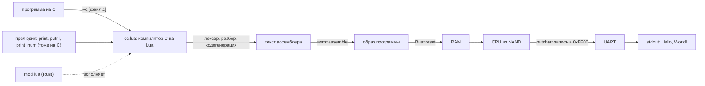
```mermaid
graph LR
    c["программа на C"] -->|"--c [файл.c]"| cc["cc.lua: компилятор C на Lua"]
    prelude["прелюдия: print, putnl, print_num (тоже на C)"] --> cc
    cc -->|"лексер, разбор, кодогенерация"| asm["текст ассемблера"]
    luart["mod lua (Rust)"] -.->|"исполняет"| cc
    asm -->|"asm::assemble"| image["образ программы"]
    image -->|"Bus::reset"| ram["RAM"]
    ram --> cpu["CPU из NAND"]
    cpu -->|"putchar: запись в 0xFF00"| uart["UART"]
    uart --> out["stdout: Hello, World!"]
```

Соглашения компилятора:

| что | как |
|---|---|
| результат выражения | в `r0` |
| левый операнд бинарной операции | `push r0`, потом правый считается, `pop r0` |
| `r6` | указатель кадра (fp), `r7` это `sp` |
| вызов | аргументы кладутся слева направо `push r0`, потом `call f_имя`, после `addi sp, sp, 2*n` |
| параметр номер i из n | `[r6 + 4 + 2*(n-i)]` |
| локальные переменные | `[r6 - смещение]`, под них `addi sp, sp, -размер` |
| возврат | значение в `r0`, переход в `f_имя_ret` |
| сравнения | знаковые: перед `cmp` у обоих операндов переворачивается старший бит |
| `/` и `%` | беззнаковые, согласно операциям ALU |
| `putchar` | встроен в ассемблерную часть, ждёт флаг UART и пишет в `0xFF00` |

Локальный оптимизатор (peephole, `optimize` в `cc.lua`): после кодогенерации каждая функция проходит несколько проходов. Он удаляет избыточные `push/pop` вокруг простых операндов, склеивает `addi r0, r6, N` + `ld r0, [r0+0]` в `ld r0, [r6+N]`, превращает `ldi r0, G_x` + `ld` в `ld r0, [r5+G_x]` (компилятор использует `r5` как нулевую базу), кладёт базу массива прямо в смещение команды, а булевы значения перед `if` заменяет на прямые переходы. Оптимизация сокращает объём инструкций; это существенно для размещения шахматной программы в памяти (программа и данные располагаются ниже начального SP `0xE000`; стек растёт вниз).

Поддержано: `int`, `char`, `void`, указатели, массивы, функции, `if/else`, `while`, `for`, `break`, `continue`, `return`, `++`/`--`, `+=` и родственные, `&&`, `||`, `sizeof(тип)`, приведение типа, строки, символы, глобальные переменные.
Не поддержано: `struct`, `enum`, `switch`, `float`, `typedef`, указатели на функции, `?:`.
Отладка: `helloos --cc-asm файл.c` печатает полученный ассемблер.

## Чертёж №14. Проверка квайнов на трёх уровнях (`--quine`)

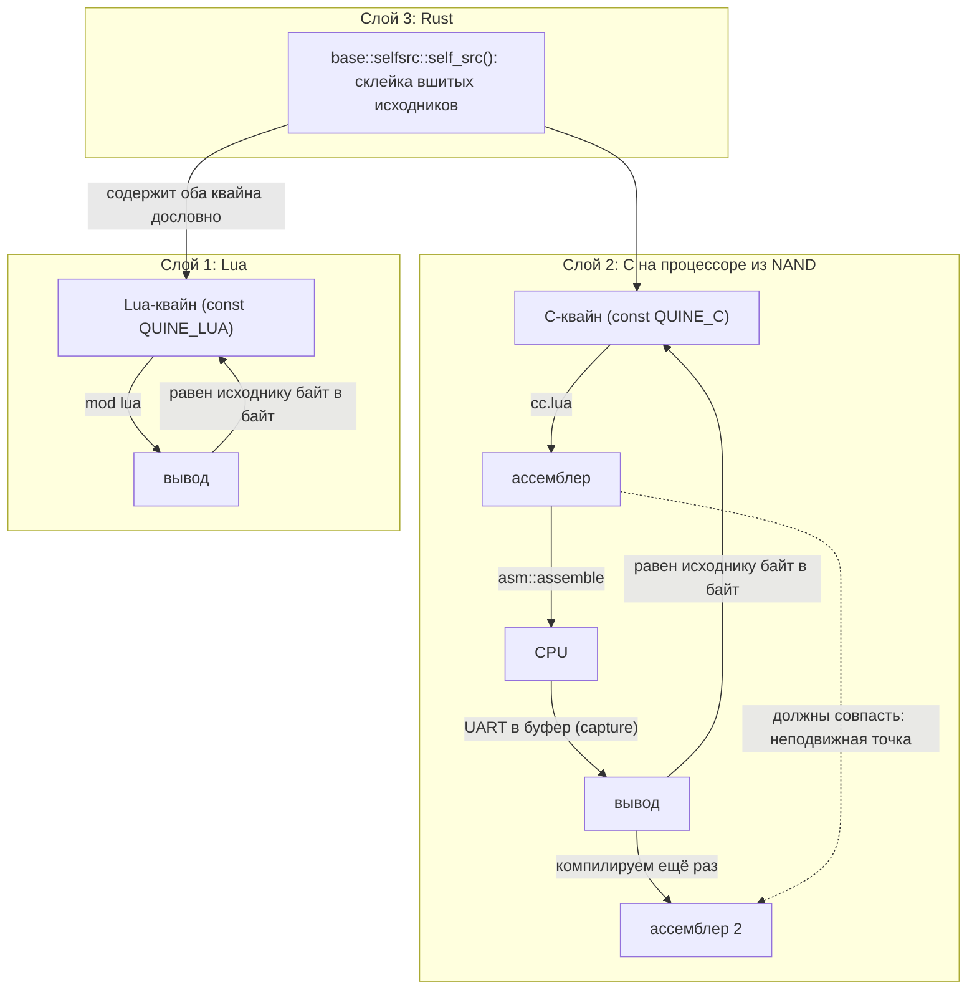
```mermaid
graph TB
    subgraph L3["Слой 3: Rust"]
        self["base::selfsrc::self_src(): склейка вшитых исходников"]
    end
    subgraph L2["Слой 2: C на процессоре из NAND"]
        cq["C-квайн (const QUINE_C)"] -->|"cc.lua"| asm["ассемблер"]
        asm -->|"asm::assemble"| cpu["CPU"]
        cpu -->|"UART в буфер (capture)"| out2["вывод"]
        out2 -->|"компилируем ещё раз"| asm2["ассемблер 2"]
        asm -.->|"должны совпасть: неподвижная точка"| asm2
    end
    subgraph L1["Слой 1: Lua"]
        lq["Lua-квайн (const QUINE_LUA)"] -->|"mod lua"| out1["вывод"]
    end
    out1 -->|"равен исходнику байт в байт"| lq
    out2 -->|"равен исходнику байт в байт"| cq
    self -->|"содержит оба квайна дословно"| lq
    self --> cq
```

Как устроен C-квайн: первая строка `char *s = "...";` содержит остальную программу, записанную с `\n`, `\"` и `\\`.
Функция `pesc` печатает эту строку с экранированием, а потом `print(s)` печатает её же без экранирования. Получается исходник целиком.
Файл начинается со строки `char *s = ...` и заканчивается без перевода строки, иначе байты не совпадут.
Запуск проверки: `helloos --quine`, выводит шесть строк `[ок]`.

## Чертёж №15. Встраивание видео

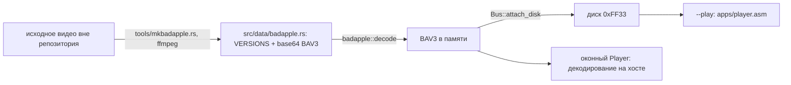
```mermaid
graph LR
    mp4["исходное видео вне репозитория"] -->|"tools/mkbadapple.rs, ffmpeg"| mod["src/data/badapple.rs: VERSIONS + base64 BAV3"]
    mod -->|"badapple::decode"| bav["BAV3 в памяти"]
    bav -->|"Bus::attach_disk"| disk["диск 0xFF33"]
    disk --> play["--play: apps/player.asm"]
    bav --> host["оконный Player: декодирование на хосте"]
```

Видеоданные Bad Apple находятся в `src/data/badapple.rs`. Таблица `VERSIONS`
связывает размеры, FPS, количество кадров и base64-строки. Для подготовки
этого ресурса используется `tools/mkbadapple.rs`. Цветные BAV4-ресурсы
создаёт `tools/mkcolorvideo.rs`. `ffmpeg` нужен при подготовке ресурсов,
а для воспроизведения вшитых данных не требуется.

`tools/mkvideo.rs`, `tools/mkaudio.rs` и `tools/embed_video.rs` относятся к
отдельному конвейеру подготовки ASC и PSG-данных. Текущий вшитый BAV3
декодируется непосредственно, без повторной упаковки ASC при запуске.
Крупные файлы данных удобнее обновлять инструментами генерации.

## Чертёж №16. Шахматы и клавиатура (`--chess`)

```mermaid
graph LR
    kb["клавиатура (stdin)"] -->|"Bus::read_input: один байт на чтение"| rx["UART RX 0xFF03"]
    rx -->|"getchar()"| rl["read_line: строка"]
    rl --> cmd["команды: help moves undo new resign hint perft fen ..."]
    rl --> pm["parse_move: e2e4 или SAN"]
    pm -->|"pick: ищет среди легальных"| lg["lg[]: легальные ходы"]
    lg --> dm["do_move: SAN, make, analyze"]
    dm --> st["analyze: шах, мат, пат, 50 ходов, повтор, материал"]
    st --> sh["show: доска из ♙♟♖♜ + статус"]
    comp["think: перебор с альфа-бета"] --> dm
    sh --> term["терминал"]
```

Шахматная программа хранится в `src/apps/chess.c` и встраивается как `apps::CHESS_C`.
В режиме `--chess` она компилируется перед запуском и выполняется на эмулируемом CPU. `cargo build --release && ./target/release/helloos --chess`.

**Что умеют.** Все ходы, шах, мат, пат, короткая и длинная рокировка (король и ладья не ходили, между пусто, король не под шахом и не проходит через битое поле), взятие на проходе, превращение пешки (Q/R/B/N, по умолчанию ферзь), ничья по правилу 50 ходов, по повторению позиции три раза и по недостатку материала (король против короля, король и лёгкая фигура против короля, одни слоны одного цвета полей). После 160 ходов партия объявляется затянувшейся и заканчивается ничьей: массивы отката рассчитаны на 320 полуходов.

**Как вводить.** В начале спрашивается режим: `1` два человека, `2` против компьютера за чёрных, `3` против компьютера за белых (тогда доска перевёрнута). Ход можно писать так: `e2e4`, `e7e8q` (координатами), `e4`, `Nf3`, `exd5`, `Nbd7`, `R1e2`, `Qxf7`, `O-O`, `O-O-O` (можно `0-0`), `e8=Q`. Знаки `+`, `#`, `!`, `?` и пробелы игнорируются, `E2E4` и `nf3` также допустимы. Неоднозначный ход (`Nc3`, когда на c3 могут пойти два коня) отклоняется с просьбой уточнить, непонятная запись вызывает короткую подсказку. Команды: `help`, `moves` (все легальные ходы в SAN), `undo` (откат; против компьютера откатывает пару полуходов), `new`, `mode` (сменить режим), `resign`, `hint` (совет компьютера), `level 1..5` (сила, по умолчанию 3), `quit`, пустая строка или Ctrl+D (выход). Для проверок: `fen <строка>` ставит позицию, `perft N` считает листья дерева ходов (N от 1 до 4), `demo N` заставляет компьютер сыграть сам с собой N полуходов.

**Как устроено.**

| функция | что делает |
|---|---|
| доска | массив `char b[128]` в формате 0x88: клетка это `ряд*16 + колонка`, а `(клетка & 136) != 0` означает выход за пределы доски. Фигуры: 1 пешка, 2 конь, 3 слон, 4 ладья, 5 ферзь, 6 король, чёрные плюс 8 |
| ход | одно число: `откуда + куда*128 + (во что превратилась пешка - 2)*16384`. Рокировка (король шагнул на два поля) и взятие на проходе (пешка пошла по диагонали на пустое поле) отдельных флагов не имеют, их видно по самому ходу |
| `gen(caps)` | псевдолегальные ходы стороны `side`; `caps=1` только взятия и превращения (для тихого поиска). Ходит по спискам фигур `pl[]`, а не по всем клеткам |
| `make` / `unmake` | сделать и отменить ход; всё нужное для отката (съеденное, права на рокировку, поле "на проходе", счётчик 50 ходов, оценка) хранится в массивах `h_*[]` |
| `attacked(sq, c)` | бьёт ли цвет `c` клетку `sq`; на ней держатся шах, рокировка и проверка легальности |
| `risky` | нужна ли вообще проверка короля после хода (нужна под шахом, при ходе короля, при ходе фигуры с линии короля и при взятии на проходе) |
| `legal_moves` | легальные ходы позиции в `lg[]`, для ввода, `moves`, мата и пата |
| `analyze` | после каждого хода: шах, мат, пат, 50 ходов, недостаток материала, повторение |
| `parse_move` | координатная запись и SAN, поиск среди `lg[]` (`pick`) |
| `san` | запись хода с уточнениями (`Nbd7`, `R1e2`), `x`, `=Q`; `+` и `#` дописывает `do_move` |
| `search`, `quiesce`, `think` | компьютер: альфа-бета (поиск с нулевым окном PVS), тихий поиск по взятиям, пропуск хода (null move), ходы-"убийцы", расширение при шахе, итеративное углубление |
| оценка | материал плюс таблица "центр лучше края" (`pv[]`, считается в `make` приращением, а не с нуля) |

**Компьютер.** Поиск ограничивается числом просмотренных позиций `budget`,
а не временем хоста: на `level 3` бюджет составляет 4500 позиций.
Глубины 1 и 2 завершаются полностью; с глубины 3 действует ограничение бюджета.
При остановке используется лучший результат уже завершённых итераций.
Длительность зависит от позиции, производительности хоста и профиля сборки.
Оценка учитывает материал и расположение фигур; ограниченный поиск
не гарантирует обнаружения комбинаций за пределами просмотренного дерева.

**Проверка.** `perft` от начальной позиции: 20, 400, 8902, 197281 (глубины 1-4); "Kiwipete" (`r3k2r/p1ppqpb1/bn2pnp1/3PN3/1p2P3/2N2Q1p/PPPBBPPP/R3K2R w KQkq -`): 48, 2039, 97862; ещё четыре позиции с шахами, рокировками и превращениями из шахматной вики. Тесты в `src/tests.rs` (`chess_*`) играют детский мат, рокировку (и запрет под шахом), взятие на проходе, превращение, пат, ничьи, perft и компьютерные ходы на эмулируемом процессоре.

Регистр приёма `0xFF03`: чтение возвращает следующий введённый байт, конец ввода это 0.

## Чертёж №17. Контроль целостности: охранники, boss и seal

Охранники проверяют согласованность вшитых исходников с контрольными значениями
и наличие заданных структурных признаков модулей. `boss::sit` координирует
проверки после валидации аргументов CLI, до запуска приложений.

```mermaid
graph TD
    main["main: proverit_args"] --> boss["boss::sit"]
    boss --> list["список из восьми охранников"]
    list --> model{"моделирование отказа: включено без --mercy"}
    model -->|"бросок совпал с ROKOVOE"| fail7["exit 7"]
    model -->|"совпадения нет или --mercy"| own["chto_sosed_nazheval: своя зона + протокол следующей"]
    own -->|"успех"| next["следующий охранник; затем 8 переводов общей стенограммы"]
    own -->|"ошибка"| neighbor{"результат проверки следующей зоны"}
    neighbor -->|"успех"| fail8["exit 8"]
    neighbor -->|"ошибка"| fail9["exit 9"]
```

| компонент | зона | `ROKOVOE` | следующая зона |
|---|---|---|---|
| Вася | `hw` | 43 | `toolchain` |
| Палыч | `toolchain` | 7 | `lang` |
| Гена | `lang` | 13 | `apps` |
| Колян | `apps` | 66 | `junk` |
| Жорик | `junk` | 21 | `data` |
| Толик | `data` | 99 | `base` |
| Михалыч | `base` | 37 | `util` |
| Степаныч | `util`, включая `boss.rs` | 88 | `hw` |

Списки контролируемых файлов заданы в `src/<зона>/guard.rs::files()`.
Зона `base` дополнительно контролирует текст лицензии `LICENSE`.
Проверяется текст, встроенный через `include_str!` при сборке, а не файлы
на диске во время запуска. `zone_sum` вычисляет FNV-1a для каждого файла,
затем объединяет результаты поворотом, XOR и умножением с переполнением `u32`.
Строки с маркером `СУММА` исключаются из хеширования, чтобы обновление ожидаемых
значений не меняло вычисляемую сумму. Для зоны `data` используется выборка
каждого 97-го байта; остальные зоны обрабатываются с шагом 1.

```mermaid
graph LR
    files["guard::files: вшитый текст"] --> sum["check::zone_sum"]
    sum --> compare["сравнение с SUMMA"]
    files --> mood["check::mood_ok: проверка маркеров в строках //"]
    compare --> own["check_own: все условия должны выполняться"]
    mood --> own
    extra["toolchain: CPU-сумма; base: структурные признаки"] --> own
```

`mood_ok` отклоняет строки комментариев, начинающиеся после отступа с `//`,
если они содержат `TODO:`, `FIXME:`, `понятный комментарий` или `объясняю доходчиво`.
Это проверка фиксированных маркеров, а не анализ содержания комментариев.

Палыч дополнительно сравнивает 16-битную взвешенную сумму `cc.lua`.
`util::check::cpu_sum` собирает гостевую программу, которая вычисляет
`Σ byte[i] × (i + 1)` по модулю 65536 и выдаёт ответ через UART.
Результат кэшируется в `static mut CPU_SUMMA` для последовательных проверок
при старте. Михалыч вызывает `base::lies::sverka`: каждый `priznak` из
`base/lies.rs` ищется в тексте `base::selfsrc::self_src()`.
Эта сверка подтверждает наличие подстрок, но не эквивалентность поведения.
`self_src()` объединяет перечисленные в `base/selfsrc.rs` исходники;
крупные видео- и аудиоданные в эту склейку не включаются.

```mermaid
graph LR
    approved["авторизованные изменения исходников"] --> seal["cargo run --bin seal"]
    seal -->|"читает списки файлов из tools/seal.rs"| sums["суммы зон и CPU-сумма cc.lua на хосте"]
    sums -->|"обновляет строки с маркером СУММА"| guards["src/*/guard.rs"]
    guards --> build["cargo build: новые тексты и значения в бинарном файле"]
```

После авторизованного изменения контролируемых файлов следует выполнить
`cargo run --bin seal`, проверить изменения ожидаемых значений и собрать
приложение заново. При добавлении файла списки в `guard.rs` и `tools/seal.rs`
нужно согласовать вручную. Контрольные значения не аутентифицируются;
механизм обнаруживает несогласованные изменения, а выборка зоны `data`
не охватывает каждый байт. Отдельные файлы `src/data/audio/**/*.txt`
не перечислены в списке охранника: для payload блоков SSND предусмотрен CRC32.

По умолчанию включён режим моделирования отказа: перед каждой проверкой
xorshift64 выдаёт число 1..100, совпадение с `ROKOVOE` завершает запуск с кодом 7.
`--seed N` делает эту последовательность повторяемой (семя нормализуется как
`N | 1`); без него используется байт, полученный из текущего времени в секундах.
`--mercy` отключает только это моделирование: проверки и коды 8/9 сохраняются.
`--debug`, `DEBUG=1` или `DEBUG=true` включают журнал семени, бросков и проверок.
После получения протоколов всех зон выполняется цикл преобразования общей
стенограммы; схема и формат приведены в чертеже №37.

## Чертёж №18. Кэш, MMU и генератор случайностей

Шина реализует кэш чтения, страничное преобразование адресов и LFSR.

```mermaid
graph LR
    cpu["cpu.step"] -->|"peek(addr)"| mmu{"MMU вкл?"}
    mmu -->|"нет"| cache
    mmu -->|"да: addr >> 8"| table["таблица 0xFB00"]
    table -->|"entry 0x8000 | page"| cache
    table -->|"entry без 0x8000"| fault["page fault, вектор 5"]
    cache{"кэш: 64 строки x 8 байт"} -->|"попадание"| hit["hits += 1, отдать байт"]
    cache -->|"промах"| fill["заполнить строку, misses += 1, tick()"]
    fill --> hit2["отдать байт"]
```

**Кэш.** Прямого отображения: `строка = (addr >> 3) & 63`, тег `addr >> 9`.
В строке 8 байт. Попадание просто отдаёт байт, промах заполняет строку
и вызывает `tick()`. Из-за этого таймер идёт чуть быстрее, когда кода много
и он не помещается в 512 байт кэша. Промахи видны в `0xFF23`, попадания
в `0xFF22` (младшие 8 бит счётчиков).

**MMU.** Страницы по 256 байт. Таблица на 256 записей лежит в `0xFB00`.
Запись: бит 15 = страница отображена, младшие 8 бит = физическая страница.
Виртуальный адрес `0x0134` при записи `0x8002` читается как физический `0x0234`.
Нет бита 15 -- страница не отображена, `peek` возвращает 0 и ставит флаг;
CPU при разрешённых прерываниях уходит на вектор 5. Обращения к таблице страниц и векторам выполняются без преобразования адреса.
Таблица находится в общей RAM и не обеспечивает изоляцию от гостевой программы.

**Генератор.** 16-битный LFSR, отводы 0, 2, 3, 5, начальное состояние `0xACE1`.
Чтение `0xFF21` сдвигает его и отдаёт младший байт, запись задаёт семя
(0 и 1 заменяются на `0xACE1`, чтобы не выродиться в ноль). Отдельный режим `--unlucky [байт]` моделирует отказы: при байте, кратном 20,
возможны паника, бесконечное ожидание либо вывод `Hello, Wor` с последующим
ожиданием. Явные значения `0`, `20`, `40` воспроизводят эти три случая.
Без значения используется `boss::random_byte()`, зависящий от времени в секундах,
а не LFSR устройства. `--seed` на этот байт не влияет. Без `--unlucky` данная
модель не вызывается; отдельное моделирование в `boss` включено по умолчанию
и отключается флагом `--mercy`.

## Чертёж №19. Свой терминал и мини-плеер

Оконный терминал рисует собственную сетку символов через SDL2.
Консольные режимы продолжают использовать stdin, stdout и stderr хоста.

```mermaid
graph TD
    main["main()"] -->|"без аргументов + DISPLAY/WAYLAND_DISPLAY, или --term"| term["apps::term::run"]
    term -->|"SDL_CreateWindow"| sdl["SDL2 (FFI): Wayland или X11"]
    term -->|"сетка 100x30"| grid["Term: Cell { ch, fg, bg }"]
    grid -->|"render: FONT8X16"| pixels["Vec<u32> 800x480"]
    pixels -->|"SDL_UpdateTexture"| sdl
    sdl -->|"SDL_KEYDOWN"| keys["Key: Char, Left, Right, Up, Home ..."]
    keys -->|"шелл"| shell["Shell: help, hello, play, clear, quit"]
    keys -->|"плеер"| player["Player"]
    player -->|"BAV2/BAV3/BAV4: RLE кадры + 10 байт звука"| frames["W×H символов, в BAV4 ещё fg/bg"]
    frames --> grid
    player -->|"отдельный SSND-трек -> PCM u8"| psg["AudioOut -> pw-cat/paplay или WAV"]
    shell -->|"hello: asm + CPU + UART"| grid
```

**Графический backend.** Приложение вызывает системную `libSDL2` через FFI;
SDL2 выбирает Wayland или X11. Отсутствие Rust crates в `Cargo.toml`
не исключает системных зависимостей: для окна требуется SDL2,
а для GPU-режимов — Vulkan и подходящий драйвер.
Размер окна можно изменять: событие `SDL_WINDOWEVENT_SIZE_CHANGED` пересчитывает сетку
(`cols = ширина/8`, `rows = высота/16`), содержимое сохраняется.
Шрифт — консольный PSF2, сконвертированный `tools/mkfont.rs` в `font.rs`.
Растеризация выполняется в приложении, пиксели передаются в текстуру SDL2;
при запуске системный PSF2 и fontconfig не используются.

**Ввод.** SDL2 отдаёт `SDL_KEYDOWN` и keysym. Стрелки/Home/End/Esc
превращаются в `Key::Left`/`Right`/`Up`/`Down`/`Home`/`Escape`.
Шелл печатает ввод в строке `summum>` (курсор `cx/cy` ставится после баннера),
плеер забирает те же клавиши, когда активен.

**Плеер.** В `src/data/badapple.rs` лежат 14 размеров (24×9 … 192×72),
каждый — BAV3 в base64; в шапке файла индекс строк. Плеер выбирает самый
большой, который влезает в окно, и пересчитывает при ресайзе; `[`/`]`
переключают вручную. Формат BAV4 хранит на каждую клетку `ch`, `fg`, `bg`
(индексы `term::COLORS`), поэтому цветной ролик можно вшить без переделки
терминала; BAV2/BAV3 получают цвет по символу, как раньше. `tools/mkcolorvideo.rs`
делает BAV4 из mp4 (ffmpeg только на этапе сборки ассета). Плавный режим
смешивает только символы, цвет берётся из текущего кадра.
Управление читается из `src/data/controls.txt`.
Прогресс-бар считается по номеру кадра, перемотка — ±10 секунд.
Звук декодируется из отдельного SSND-трека в PCM (7 качеств у Bad Apple), `A` меняет качество, `Up`/`Down` — громкость, `M` — mute (чертёж №20).
Оконный плеер декодирует кадры на хосте. Консольный `--play` использует
отдельный тракт через `player.asm`, гостевую видеопамять и PSG.

**Режимы.** Без аргументов, при наличии `DISPLAY` или `WAYLAND_DISPLAY`
и отсутствии переменной `SUMMUM_PLAIN`, запускается оконный терминал.
`--term` включает его явно; `--plain` выбирает консольный запуск `Hello, World!`.
Если добавлены служебные флаги, например `--mercy`, для окна нужен `--term`. `--term --badapple`
сразу открывает плеер.

## Чертёж №20. Аудиокодек SUMMUM-SND/2

```mermaid
graph LR
    mp4["mp4"] -->|"ffmpeg -ac 1 -ar N -f s16le"| conv["tools/mkcodec.rs"]
    conv -->|"блоки + ADPCM + XOR + CRC"| files["src/data/audio/badapple/s*.txt"]
    files -->|"include_str! + snd::text_to_raw"| data["src/data/audio.rs"]
    data -->|"A переключает 32..256 кбит/с"| decode["decode: блоки -> PCM u8"]
    decode -->|"позиция = (frame * rate) / fps"| out["AudioOut"]
    out -->|"pw-cat --playback --raw"| pipe["PipeWire / PulseAudio"]
    out -->|"если нет"| wav["out.wav"]
```

**Контейнер.** Текстовые файлы начинаются с `SUMMUM-SND-TXT/2` и содержат
base64 бинарного SSND v2. Декодер проверяет сигнатуру `SSND` и байт версии 2.
XOR с LFSR служит преобразованием потока и не является шифрованием.

**Кодек.** Блок 1024 сэмпла. В шапке блока: `prev1`, `prev2`, `step_index`,
`order`, `xkey`, `count`, `CRC32`. Предсказание второго порядка
`p = 2*prev1 - prev2`, остаток квантуется в 4 бита адаптивным шагом IMA,
полубайты XOR-ятся потоком LFSR (ключ свой на блок), два полубайта на байт,
порядок чередуется по номеру блока. При несовпадении CRC32 payload блок заменяется тишиной.

**Качества.** 32, 48, 64, 96, 128, 192 и 256 кбит/с (частота × 4).
Максимум — 256 кбит/с. Файлы Bad Apple лежат в `src/data/audio/badapple/`, Rickroll — в `src/data/audio/rick/`.
Данные третьего трека лежат в `src/data/audio/execute_me/`.

**Выход.** `pw-cat` запускается с `--raw --format u8 --channels 1`,
чтобы интерпретировать stdin как PCM без WAV-заголовка. При невозможности
создать канал `AudioOut` пробует `paplay`, затем накапливает данные для `out.wav`.
Успешный запуск дочернего процесса не подтверждает готовность аудиоустройства;
ошибка уже работающего канала не переключает его автоматически на WAV.
В сборке тестов (`cfg(test)`) и при `HELLO_AUDIO=off` `AudioOut::open`
сразу выбирает `Off`: записи отбрасываются, завершение не создаёт WAV
и дочерние аудиопроцессы не запускаются.

**Синхронизация.** Аудиопозиция считается из номера кадра:
`(frame × rate) / fps` с целочисленным делением. Пауза ставит позицию на текущий кадр, перемотка
сбрасывает её, задавая новую позицию чтения PCM. За один вызов синхронизации передаётся
не более 250 мс PCM, что ограничивает объём догоняющего аудио.

## Чертёж №21. Три трека: Bad Apple, Rickroll и world.execute(me);

```mermaid
graph TD
    play["команда play"] --> bad["badapple::VERSIONS (14 размеров, до 192x72)"]
    rick["команда rickroll / --rickroll"] --> roll["rickroll::VERSIONS (5 размеров, до 192x54)"]
    exe["команда execute / --execute"] --> ex["execute_me::VERSIONS (5 размеров, до 192x54, BAV4 цветной)"]
    bad --> vid["data/video.rs: Version + best_for"]
    roll --> vid
    ex --> vid
    vid -->|"версия под окно"| player["Player"]
    t["T: switch_track (по кругу 0 -> 1 -> 2 -> 0)"] --> player
    player -->|"кадры"| term["Term"]
    bad --> ba["data/audio.rs: 7 качеств до 256 кбит/с"]
    roll --> ra["data/rickroll_audio.rs: 3 качества до 256 кбит/с"]
    ex --> ea["data/execute_me_audio.rs: 3 качества до 256 кбит/с"]
    ba --> snd["SSND decode"]
    ra --> snd
    ea --> snd
    snd --> player
```

`Player` хранит `versions` как срез, а `qualities` — в `Fonoteka`.
Вшитые качества представлены срезом `Fonoteka::Kazennaya`; один и тот же
код воспроизводит все три трека (`track_parts`: 0/1/2). `T` переключает трек по
кругу, сохраняя громкость и mute. Каждый трек использует собственное аудио. Файловые и внешние видео (`versions` пустые, track 3)
переключаться не могут. Подробно про третий трек -- чертёж №26.

## Чертёж №25. Лучевой игровой режим (`doom`)

Режим `doom` реализует самостоятельную игру с лучевым рендерингом:
14 отрезков стен, игрок в виде круга радиуса 0.25 и один луч на колонку терминала.
Это не порт движка Doom: загрузка WAD, BSP и взаимодействие с дверями
не реализованы (`doom::open_door` не изменяет состояние).

```
карта 12x8 (вид сверху, # -- стены, P -- старт, Z/I/B -- враги, + -- выход)

  ############################
  #      #        #          #
  #  Z   #        #          #
  #      #        #          #
  #      ##########          #
  # P                       I#
  #      #        #          #
  #      #        #     +    #
  #      #        ######  B  #
  ############################
```

Луч на колонку: `ray = dir + plane * cam`, пересечение со всеми отрезками
перебором, ближайшее `t` идёт в z-буфер. Высота стены `rows / t`, цвет зависит
от отрезка и ориентации, символ -- от расстояния. Спрайты (враги и выход)
проецируются обратной матрицей камеры и проверяются по z-буферу.

Враги идут к игроку по прямой, стреляют раз в 1.5-2 секунды, если видят его.
Игрок стреляет хитсканом в конусе 0.13 радиана, тратит патрон, наносит урон выбранному противнику.
Выход -- зелёный `+`: подойти и нажать `E`. `R` -- рестарт, `Q` -- в шелл.

## Чертёж №26. Третий трек «world.execute(me);»

Видео Kaito Sugimura, YouTube `qV0aezH6Aj8`: 212 секунд, 30 fps, 16:9,
звук 48 кГц. Исходный mp4 не хранится в репозитории;
для запуска используются вшитые текстовые ресурсы в `src/data/`.

```mermaid
graph TD
    url["youtube qV0aezH6Aj8"] -->|"yt-dlp, только при сборке"| mp4["execute_me.mp4 (вне репо)"]
    mp4 --> mk1["tools/mkcolorvideo.rs, пять размеров"]
    mp4 --> mk2["tools/mkcodec.rs, 32/128/256"]
    mk1 --> v["src/data/execute_me/v64..v192.rs (BAV4, цвет)"]
    mk2 --> a["src/data/audio/execute_me/s32..s256.txt (SSND)"]
    v --> wrap["execute_me/mod.rs: VERSIONS + decode"]
    a --> wrapa["execute_me_audio.rs: QUALITIES"]
    wrap --> parts["Player::track_parts(2)"]
    wrapa --> parts
    parts --> shell["команда execute / флаг --execute / клавиша T"]
```

| размер | кадров | base64 |
|---|---|---|
| 64x18 | 6369 | 4.2 МБ |
| 96x27 | 6369 | 8.0 МБ |
| 128x36 | 6369 | 14.9 МБ |
| 160x45 | 6369 | 23.3 МБ |
| 192x54 | 6369 | 32.1 МБ |

6369 кадров при 30 fps соответствуют 212.3 секунды.
Позиция аудио рассчитывается из номера кадра и частоты дискретизации. Кадры -- BAV4 (цвет на
каждую клетку), звук лежит отдельно тремя качествами SSND, как у Rickroll.

Пересборка (ffmpeg и yt-dlp -- инструменты сборки, в рантайме их нет):

    yt-dlp -f "bv*[height<=480]+ba" --merge-output-format mp4 -o execute_me.mp4 URL
    mkcolorvideo execute_me.mp4 v64.rs 64 18 30   # и так 96x27, 128x36, 160x45, 192x54
    MKCODEC_BITRATES=32,128,256 mkcodec execute_me.mp4 src/data/audio/execute_me

Видеофайлы размещаются в `src/data/execute_me/`. Они входят в список зоны
Толика с шагом контроля 97; после авторизованных изменений контрольные
значения обновляются через `cargo run --bin seal` (см. чертёж №17).

## Чертёж №27. Обработка ошибок и управление ресурсами

Валидация CLI и образов выполняется до загрузки гостевой программы.
Ресурсы Vulkan и аудиовывода имеют явные правила владения и освобождения,
включая частично завершённую инициализацию.

```mermaid
graph TD
    args["аргументы CLI"] --> validate["base::cli::proverit_args"]
    validate -->|"ошибка"| refusal["talon: диагностика в stderr, exit 2"]
    validate -->|"успех"| boss["boss::sit: стартовые проверки"]
    files["чтение файла / UTF-8 / запись результата"] -->|"ошибка в CLI-ветке"| refusal
    asm["ассемблер"] --> size["ByuroAdresov: размер не более 65280, уникальность меток"]
    size --> load["Bus::reset: проверка длины до копирования"]
    load --> ram["RAM"]
    vk["создание Vulkan"] --> owner["Gpu: владение ресурсами с первого успешного этапа"]
    owner --> check["проверки VkResult и адреса отображённой памяти"]
    check -->|"ошибка"| cleanup["Drop: освобождение созданных ресурсов"]
    check -->|"успех"| ready["готовый Gpu"]
    snd["внешнее аудио"] --> storage["Fonoteka::Chemodan: владеющий String"]
    storage --> release["освобождение при удалении владельца"]
    audio["AudioOut::finish"] --> drain["до 750 мс на завершение писателя"]
    drain --> cancel["при тайм-ауте: stop + kill, до 250 мс на подтверждение"]
    cancel --> child["опрос child: до 2 с"]
    child --> reap["если процесс остался: kill и wait в отдельном потоке"]
```

`ByuroAdresov` проверяет размер после каждой строки ассемблера. Повторная
метка отклоняется с номером строки. `Bus::reset` отдельно проверяет длину
образа относительно выделенной RAM и при отказе не изменяет её содержимое.
`--pack` требует два пути, `--asm` и `--lua` — один, `--seed` — число `u64`.
Файловые ошибки консольных операций и некорректный UTF-8 в `read_text`
передаются в `talon` и завершают процесс с кодом 2.

При инициализации Vulkan дескрипторы `Gpu` имеют нулевые начальные значения.
Каждый успешно созданный ресурс сразу записывается во владеющий объект,
поэтому ранний выход запускает очистку через `Drop`. Буфер уничтожается
перед освобождением его памяти. Срез создаётся после успешного отображения
с ненулевым адресом. Буферы для сырых свойств драйвера выровнены на 8 байт.
Проверяются результаты начала и завершения записи команд.

`Fonoteka::Kazennaya` ссылается на вшитые аудиоданные,
`Fonoteka::Chemodan` владеет текстом внешнего файла через `String`.
Срок жизни внешнего аудио ограничен сроком жизни владельца.

На Linux `AudioOut` устанавливает `O_NONBLOCK` для stdin дочернего процесса
через FFI к `fcntl`. Поток записи проверяет атомарный флаг отмены между
неблокирующими попытками записи. Очередь ограничена восемью порциями;
при переполнении новая порция отбрасывается, чтобы сохранить отзывчивость видео
и ввода. Если неблокирующий канал создать нельзя, выбирается WAV; на других
платформах эта реализация канала недоступна.

`finish` сначала закрывает очередь и даёт писателю до 750 мс на завершение.
Если подтверждение не пришло, устанавливает флаг отмены, отправляет `kill`
дочернему процессу и ждёт подтверждение ещё до 250 мс. Затем процессу даётся
до 2 с на завершение. Оставшийся процесс принудительно завершается,
а `wait` переносится в отдельный поток. Эти интервалы ограничивают явные
ожидания; планировщик ОС и системные вызовы могут добавить задержку.
WAV-ветка накапливает PCM в памяти и при завершении синхронно записывает
`out.wav`; ошибки создания и записи этого файла не выводятся пользователю.

## Чертёж №28. Избыточное представление слова

`Word` хранит 16 логических битов как `[[bool; 3]; 16]` и занимает 48 байт.
Он остаётся `Copy`. Каждый бит вычисляется большинством трёх голосов через
NAND. Одиночное повреждение в тройке не меняет логического значения;
две согласованные повреждённые копии этот механизм исправить не может.

```mermaid
graph LR
    three["три голоса бита"] --> majority["большинство через NAND"]
    majority --> observe["podslushat / to_u16: наблюдение"]
    majority --> repair["sprosit_u_taburetki / vytashchit_kartoshku / pereobut: запись большинства во все голоса"]
    repair --> cpu["CPU ремонтирует владельца перед копированием операнда"]
    repair --> alu["ALU ремонтирует собственные операнды"]
```

Методы с `&self` не изменяют хранилище; восстановление выполняют методы
с `&mut self`. RAM шины по-прежнему содержит байты `u8`, а не `Word`.

## Чертёж №29. Учёт передачи UART

Передача проходит через `SpravkaNaBukvu`: последовательный номер, упакованный
символ и проверяемые значения вычисляются через NAND ALU. Распаковка должна
восстановить исходный байт. Неверный или повторный номер отклоняется до вывода.

```mermaid
graph LR
    byte["байт"] --> request["SpravkaNaBukvu::prepare"]
    request --> check["verify: номер, упаковка, контрольные значения"]
    check --> journal["кольцевой журнал: 32 записи"]
    journal --> output["ровно одна передача: stdout либо capture"]
```

Журнал ограничен 32 записями и не увеличивается при длительной передаче.
Счётчик номеров не оборачивается: после его исчерпания новая передача
отклоняется. Учёт одинаково применяется к обычному и захватываемому UART.

## Чертёж №30. Контейнер RZDV и потоковое преобразование

`toolchain::vedro_s_dyrkoy` кодирует байт как восемь ASCII-троек в порядке от старшего
бита: значение, отрицание, номер позиции `0..7`. Запись начинается с `+`.
Контейнер начинается с четырёх байтов `RZDV` и байта версии `1`, завершается
точкой и EOF. Размер составляет `25 × N + 6` байт.

```mermaid
graph LR
    source["Read"] --> encoder["nakachat_sapog_bez_razmera: заголовок, записи, терминатор"]
    encoder --> file["Write: контейнер RZDV"]
    file --> decoder["DoyarkaTapka: версия, тройки, терминатор и EOF"]
    decoder --> atlas["атлас байтов, чертёж №31"]
    atlas --> restored["исходные байты"]
```

Потоковые encoder/decoder используют буферы фиксированного размера и не
доверяют внешним длинам. DoyarkaTapka возвращает по одному байту и после ошибки
остаётся в состоянии отказа. Для проверки терминатора и отсутствия мусора
поток требуется дочитать до EOF.

`--razduv вход выход` и `--unrazduv вход выход` доступны в `helloos`;
`nasos [--decode] вход выход` выполняет те же операции без запуска
эмулируемой машины. `pereselit_tapok` записывает временный файл рядом с
назначением и заменяет результат только после успешного преобразования
и сброса буфера. Ошибка декодирования сохраняет прежний файл назначения.
Допускается преобразование файла на месте. Встроенный `privet_iz_pelmenya.rzd` загружается
через `include_bytes!`; его 356 байт восстанавливают 14 байт `privet_iz_pelmenya.txt`.

## Чертёж №31. Атлас байтов

`toolchain::pasport_kartoshki` один раз создаёт 256 карточек в `OnceLock`. Карточка содержит
значение, двоичную, обратную и инверсную записи, промежуточные NAND-значения
и проверочный сертификат. Атлас хранится в фиксированном массиве.

```mermaid
graph LR
    input["проверенный байт RZDV"] --> scan["opytat_vsyu_kartoshku: обход всех 256 карточек"]
    scan --> nand["проверка представлений через NAND"]
    nand --> seal["проверка сертификатов и общей суммы"]
    seal --> result["восстановленный байт либо InvalidData"]
```

Обход не прерывается ни после совпадения, ни после обнаружения повреждения.
Volatile-чтения карточек и атомарный счётчик сохраняют наблюдаемую работу;
`skolko_kartoshki_obnyuhali()` показывает суммарное число посещений. Сертификаты
обнаруживают несогласованность представлений, но не аутентифицируют данные.

## Чертёж №32. Контролируемые преобразования IR компилятора

В `cc.lua` добавлены два прохода перед штатной оптимизацией. A вставляет
служебную метку и `mov r0,r0`, B проверяет структуру этих пар и удаляет их.
По умолчанию выполняются ровно три раунда; глобальная переменная
`SKOLKO_DERUTSYA_VILKI` допускает целые значения от 0 до 8 для проверок.

```mermaid
graph LR
    ir["исходный IR"] --> canon["независимая штатная оптимизация: канон"]
    ir --> a["A: вставка служебных пар"]
    a --> b["B: проверка и удаление"]
    b --> rounds["фиксированное число раундов"]
    rounds --> restore["проверка точного восстановления IR"]
    restore --> standard["шесть штатных проходов"]
    standard --> compare["побайтовое сравнение с каноном"]
    canon --> compare
```

`KTO_SYEL_TABURETKU` сообщает объём обработки. Проверяется точное совпадение
ассемблера, включая программы шахмат и C-квайн; расхождение считается ошибкой.

## Чертёж №33. Свидетельство сортировки

`bubble::spravka_o_sosiskah(seed)` сортирует 32 числа и сохраняет не более 496
соседних перестановок. Seed при обычном запуске зависит от времени и
ограниченных префиксов аргументов и `BUBBLE_SEED`.

```mermaid
graph LR
    seed["seed запуска"] --> sort["массив и журнал перестановок"]
    sort --> replay["proverit_tanec_sosisk: независимое воспроизведение"]
    replay --> text["сериализация свидетельства"]
    text --> lua["разбор собственным Lua"]
    lua --> verify["повторная независимая проверка"]
    verify --> sink["подтверждённый digest влияет на SINK и run_all"]
```

Проверяется исходный массив, границы перестановок, полученный порядок и
контрольное значение. Свидетельство не является произвольным Lua-скриптом
пользователя: сериализатор формирует ограниченное представление своих данных.

Для решета добавлен `GorohSPechatyu`: список простых до 20000 и число
составных. `proverit_goroh_na_vshivost` независимо проверяет все числа делением до
квадратного корня, сверяет список и счётчик. При передаче через Lua список
кодируется одной ограниченной строкой; после разбора он проверяется повторно.
Подтверждённый digest входит в `SINK`, а `check_temperature()` по-прежнему
возвращает 2262.

## Чертёж №34. Событийная модель NAND

Прямой NAND остаётся режимом по умолчанию. `--event-nand` включает событийную
модель после стартовых проверок: восемь именованных проводов, шесть вентилей
и фиксированная очередь из восьми событий. Проверяются три эквивалентные
реализации NAND. Рекурсивного вызова публичного `nand` внутри модели нет.

```mermaid
graph LR
    flag["режим текущего потока"] --> select{"event mode?"}
    select -->|"нет"| direct["прямой NAND"]
    select -->|"да"| queue["два входа и распространение восьми событий"]
    queue --> agree["сверка трёх выходов"]
    agree --> output["результат и счётчики"]
```

Режим и статистика хранятся отдельно для каждого потока. CLI переносит режим
в свои потоки Lua и компилятора C; произвольный новый поток начинает с прямого
режима. `pomet_na_provode()` возвращает число событийных NAND и обработанных
событий. Событийная модель требует существенно больше работы на вентиль,
поэтому включается явно; стартовый контроль исходников выполняется до неё.

## Чертёж №35. Ограниченная история RAM

Физические адреса `0x0100..0x02FF` имеют по восемь квитанций о записи:
старое значение, новое, последовательный номер и контроль допуска.
Всего выделяется 512 дел фиксированного размера; при заполнении кольца
базовое значение продвигается, сохраняя возможность воспроизведения.

```mermaid
graph LR
    virtual["виртуальный адрес"] --> mmu["перевод MMU"]
    mmu --> physical["физический адрес"]
    physical --> tracked{"адрес отслеживается?"}
    tracked -->|"да"| replay["воспроизведение квитанций и сверка RAM"]
    replay --> cache["проверка также при cache-hit"]
    tracked -->|"нет"| cache
    cache --> read["байт либо fault"]
```

MMU aliases разделяют одно дело физического адреса. Повреждение квитанции,
RAM или кэшированного байта выставляет `fault`; чтение возвращает ноль,
запись отклоняется. `load/reset` синхронизируют базовые значения; `reset`
отклоняется до загрузки RAM. `skolko_baytov_doprosili()` возвращает число
воспроизведений и обработанных квитанций с ограниченными счётчиками.

## Чертёж №36. Гостевой журнал вывода Hello World

Обычный Hello World и команда `hello` оконного терминала восстанавливают
сообщение из встроенного RZDV, затем вызывают `zayavlenie_na_chetyre_taburetki`.
Все этапы ниже исполняются на гостевом CPU.

```mermaid
graph LR
    archive["privet_iz_pelmenya.rzd -> атлас -> сообщение"] --> build["гость 1: журнал в RAM"]
    build --> replay["гость 2: воспроизведение в буфер"]
    replay --> verify["гость 3: проверка по отдельной копии сообщения"]
    verify --> final["гость 4: единственный окончательный UART"]
```

Журнал вмещает до 256 операций и занимает 514 байт, буфер — 258 байт.
Первые три запуска ограничены 200000 циклами каждый; промежуточный UART
запрещён. Проверяются длина, операции, данные и итоговый буфер. Передача
поддерживает нулевые байты и пустое сообщение. Обычный `--c` сохраняет
прежнюю демонстрационную программу и её 68 байт вывода.

## Чертёж №37. Протоколы зон и общая стенограмма

Каждая зона сохраняет `check/check_own/summa` для совместимости, но startup
получает от `chto_sosed_nazheval()` текстовую запись идентификатора зоны, суммы и
результата `check_own`. Босс проверяет записи собственной и следующей зон.

```mermaid
graph LR
    zones["8 chto_sosed_nazheval: независимые проверки зон"] --> original["исходные 8 записей"]
    original --> minutes["ROUND1: этап 0 и идентификатор сеанса"]
    minutes --> ring["ровно 8 последовательных perezhuy_za_soseda соседями"]
    ring --> compare["после каждого этапа и в конце: сверка с исходными записями"]
    original --> compare
    compare --> start["запуск приложения"]
```

Этапы используют системы счисления 10, 16, 2, 8, 3, 4, 6 и 36, разные
разделители и порядки полей. Каждый перевод повторяет проверку своей зоны.
Общая стенограмма ограничена 4096 байтами, отдельная запись — 64.
Версия, сеанс, номер этапа, зона, сумма и результат разбираются строго;
обратная каноническая запись исключает неоднозначные представления.
Повтор этапа, неправильный порядок и изменённая запись отклоняются.
`--debug` показывает восемь этапов. Прежние коды отказа 7/8/9 сохранены.

## Справочник названий и фактических операций

Таблица уточняет контракты функций, побочные эффекты и ограничения,
которые существенны при чтении и использовании кода. Идентификаторы
приведены в том виде, в котором они используются в исходниках.

| идентификатор или компонент | фактическая операция и ограничения |
|---|---|
| `ByuroAdresov` | проверяет допустимый размер образа и уникальность меток ассемблера |
| `base::cli::talon` | извлекает успешное значение `Result` либо печатает ошибку и завершает процесс с кодом 2 |
| `Gpu`, локальная переменная `akt` | владеет созданными ресурсами Vulkan, в том числе при незавершённом конструкторе |
| `Fonoteka::Chemodan` | владеет текстом внешнего аудио через `String` |
| `Uvolnenie` | хранит очередь аудио, флаг отмены, подтверждение завершения, поток записи и дочерний процесс |
| `alu::full_adder` | возвращает пару `(перенос, сумма)` |
| `alu::negate` | побитовое NOT |
| `alu::complement` | отрицание в дополнительном коде: NOT + 1 |
| `alu::shl1`, `alu::shr1` | сдвиг на один бит влево и вправо соответственно |
| `gates::mux(sel, a, b)` | выбирает `a` при `sel = false`, `b` при `sel = true` |
| `Cpu::decode` | читает четыре байта инструкции по PC и увеличивает PC |
| `Cpu::fetch` | разбирает поля инструкции |
| `Cpu::writeback` | исполняет инструкцию и подготавливает результат |
| `Cpu::execute` | записывает подготовленный результат в регистр при установленном `wr` |
| `Bus::peek` | читает байт; изменяет счётчик чтений, состояние UART и, для MMIO, состояние устройства |
| `Bus::load` | выделяет RAM |
| `Bus::reset` | проверяет размер и копирует образ в RAM |
| `alu::sub_flags` | возвращает результат вычитания и перенос; перенос 1 означает `a >= b` без знака |
| `alu::divmod` | возвращает `(частное, остаток)` |
| `alu::mul` | вычисляет младшие 16 бит произведения сложением сдвинутых копий |
| `Bus::tick` | обновляет таймер и защёлку прерывания |
| `Cpu::set_cmp` | сохраняет Z, N, C по результату вычитания, не записывая сам результат |
| `STI`, `CLI` | разрешают и запрещают прерывания соответственно |
| `Bus::present` | выводит ANSI-кадр, синтезирует аудио и выдерживает расписание кадров |
| `Bus::finish` | завершает аудиовывод и восстанавливает отображение курсора консоли |
| `toolchain::pack` | кодирует текстовые кадры RLE и добавляет PSG-данные в BAV2 |
| чтение `0xFF33` | возвращает байт диска и увеличивает адрес чтения |
| `Bus::render` | смешивает три прямоугольных сигнала и шум в 8-битный PCM |
| `Bus::open_audio` | выбирает `pw-cat`, `paplay` либо WAV для гостевого PSG |
| `Table::len` | возвращает длину массивной части таблицы Lua |
| `Interp::exec_scoped` | выполняет блок в новой области видимости |
| `lua::compile` | разбирает программу в дерево; выполнение выполняет интерпретатор |
| `compile_c_big` | запускает компиляцию C в отдельном потоке с увеличенным стеком |
| `Bus::capture_uart` | направляет UART в буфер вместо stdout |
| `Bus::take_captured` | возвращает накопленные байты и очищает буфер |
| `base::selfsrc::self_src` | объединяет явно перечисленные вшитые исходники, без крупных медиаданных |
| `base::lies::sverka` | проверяет наличие подстрок `priznak` в переданном тексте исходников |
| `Bus::read_input` | читает следующий байт; при использовании stdin может блокироваться |
| `Bus::feed_input` | задаёт буфер ввода вместо чтения с клавиатуры |
| охранники и `boss` | сверяют контрольные значения и признаки модулей; моделирование отказов описано в чертеже №17 |
| `tools/seal.rs` | обновляет ожидаемые значения после авторизованных изменений; требует последующей пересборки |
| `--mercy` | отключает моделирование отказов в `boss`; проверки целостности и `--unlucky` действуют независимо |
| `check::mood_ok` | проверяет четыре фиксированных маркера в строках комментариев `//` |
| `check_disk_health` | увеличивает внутренний счётчик и возвращает `true`; аппаратную диагностику диска не выполняет |
| `--unlucky` | включает отдельную модель отказов; явный байт задаёт воспроизводимый сценарий |
| кэш | моделирует кэш чтения; промах дополнительно вызывает `tick`, влияя на гостевой таймер |
| MMU | преобразует адреса по таблице в общей RAM; не изолирует таблицу от гостевой записи |
| оконный терминал | рисует через системную SDL2, используя встроенный растровый шрифт |
| оконный плеер | декодирует BAV2/BAV3/BAV4 на хосте и выбирает версию под размер окна |
| аудио плеера | декодирует SSND в PCM; консольный `--play` использует гостевой PSG |
| SSND v2 | предсказание второго порядка, ADPCM, XOR с LFSR и CRC32 payload каждого блока |
| `T` в плеере | переключает три вшитых трека по кругу; сохраняет кадр, если он допустим в новом треке |
| `doom::open_door` | не изменяет состояние; двери не реализованы |
| `bubble::klass_simvola` | классифицирует ASCII 32..126 |
| `bubble::kontrolnaya_summa8` | вычисляет сумму восьми байтов; повторный расчёт не влияет на результат |
| `execute_me::proverka_razmerov` | возвращает количество версий, не проверяя их содержимое |

## Лицензия и уведомления

Текст условий распространения находится в `LICENSE`; манифест Cargo указывает
его через `license-file`. Консольный стартовый баннер содержит русское
уведомление, оконный терминал — предусмотренный лицензией вариант ASCII.
Файл лицензии включён в контрольную область `base` и в `self_src()`.
После изменения лицензии контрольные значения обновляются через `tools/seal.rs`.

## Чертёж №38. Загрузка Мега-ОС с виртуального диска

`--seal-mega <путь>` ассемблирует ядро и записывает запечатанный образ.
Эта отдельная операция не запускает гостевую машину. `--mega-os` читает
`src/mega_os/yadro_v_tapke.img` относительно корня исходного проекта;
`--mega-os --mega-image <путь>` выбирает другой образ. Запуск не пересоздаёт
образ автоматически. После изменения исходников из списка ключа нужно
пересобрать исполняемый файл и выполнить `--seal-mega`.

```mermaid
flowchart TD
    S[Явно перечисленные исходники] --> F[FNV1a64: имя, NUL, байты файла]
    A[Гостевое ядро: kernel.asm] --> B[Ассемблирование с адресом 0x2000]
    B --> C[CRC16 и потоковое XOR-преобразование]
    F --> C
    C --> D[Диск MEGATPK1]
    D --> H[Хост: формат, размер, адрес, fingerprint]
    H --> R[ROM: гостевые чтения DISK_DATA 0xFF33]
    R --> M[Гостевая расшифровка в RAM]
    M --> V[Гостевой CRC16 по RAM]
    V --> K{CRC совпадает?}
    K -->|да| J[JMP 0x2000]
    K -->|нет| E[Статус 4 и остановка]
```

Заголовок занимает 32 байта: `MEGATPK1` по смещению 0, длина ядра LE16
по смещению 8, адрес входа LE16 по смещению 10, ожидаемая CRC16 LE16 по
смещению 12, fingerprint LE64 по смещению 16. Остальные байты заголовка
нулевые. Payload занимает 4–20480 байт; хвост сверх объявленной длины
отклоняется. Ядро размещается в диапазоне `0x2000..0x7000`.

Ключ зависит от четырнадцати файлов: `main.rs`, `base/cli.rs`,
`mega_os/mod.rs`, `mega_os/boot.rs`, `mega_os/kernel.rs`,
`mega_os/kernel.asm`, `mega_os/rebenok.asm`, `hw/cpu.rs`, `hw/isa.rs`, `hw/alu.rs`, `hw/word.rs`,
`hw/gates.rs`, `hw/bus.rs`, `toolchain/asm.rs`. Используются байты файлов,
включённые при компиляции исполняемой программы. Изменение других файлов
не меняет этот ключ. Генерируемый образ и контрольные значения охранников
в список не входят, поэтому пересчёт не образует цикл.

Поток XOR использует 16-битное состояние; это обратимая обфускация,
не криптографическая защита или подпись. CRC16/CCITT-FALSE использует
полином `0x1021`, начальное значение `0xffff`, без отражения и финального XOR.
Хост вычисляет CRC при запечатывании. При загрузке вычисление CRC,
сравнение и переход к ядру выполняет гостевой CPU через NAND ALU.
Статус загрузки лежит по адресу `0x1000`: 1 — загрузка, 2 — CRC,
3 — проверено, 4 — несовпадение CRC. Вычисленная CRC находится в `0x1002`.
Число исполняемых инструкций ограничено; ошибка не запускает ядро.
Чтение файла образа ограничено 20513 байтами: при превышении допустимых
20512 байт хост возвращает ошибку до запуска ROM.

## Чертёж №39. Процессы и файловая система Мега-ОС

Гостевое ядро создаёт три процесса; отдельный idle PCB ждёт, когда все спят.
Свободный четвёртый слот занимают дети `fork` и `exec`. Аппаратный таймер
подаёт IRQ 1; обработчик сохраняет семь общих регистров, SP, PC и флаги,
выбирает следующий готовый процесс по кругу и возвращается через `IRET`.
Системные вызовы используют `INT 2`. Во время обработки прерывания
вложенные прерывания выключены.

```mermaid
flowchart LR
    T[Таймер: IRQ 1] --> SAVE[Сохранение контекста в стеке процесса]
    U[Процесс: INT 2] --> SAVE
    SAVE --> S[Обработчик таймера или системного вызова]
    S --> RR[Выбор готового процесса]
    RR --> RESTORE[Загрузка SP и восстановление контекста]
    RESTORE --> I[IRET]
    S --> FS[Каталог и данные файлов в RAM]
    S --> UART[Вывод через UART]
```

| Область | Назначение |
|---|---|
| `0x8000`, шаг 32 байта | Четыре PCB: SP, состояние, остаток сна, число запусков, код выхода, вершина стека |
| `0x8080` | Отдельный PCB idle, вне четырёх пользовательских слотов |
| `0x8100..0x8200` | Текущий процесс, счётчики и результат сценария |
| `0x9000..0x9880` | Восемь файловых слотов по 272 байта |
| `0xa000` | Буферы процессов |
| вершины `0xb000`, `0xb400`, `0xb800`, `0xbc00` | Стеки процессов |

Состояния процесса: 0 — завершён, 1 — готов, 2 — спит.
`r0` задаёт системный вызов и принимает результат; остальные регистры
сохраняются. Ошибка аргументов возвращает `0xffff`, отсутствие файла — `0xfffe`.

| `r0` | Операция | Аргументы |
|---|---|---|
| 1 | `write` в UART | `r1`: адрес, `r2`: длина до 256 |
| 2 | `sleep` | `r1`: число тиков; 0 эквивалентен `yield` |
| 3 | `yield` | Передать выполнение следующему готовому процессу |
| 4 | `exit` | `r1`: код завершения; не возвращается |
| 5 | Записать файл целиком | `r1`: номер 1–8, `r2`: адрес, `r3`: длина до 256 |
| 6 | Прочитать файл целиком | `r1`: номер 1–8, `r2`: адрес, `r3`: вместимость до 256 |
| 7 | Удалить файл | `r1`: номер 1–8 |
| 8 | `exec`: загрузить процесс из файла | `r1`: номер 1–8, `r2`: адрес кода, `r3`: вершина стека |
| 9 | `mkdir`: создать каталог | `r1`: родитель, `r2`: имя, `r3`: длина 1–8 |
| 10 | `open`: найти файл по имени | `r1`: родитель, `r2`: имя, `r3`: длина |
| 11 | `readdir`: имя ребёнка по индексу | `r1`: родитель, `r2`: индекс, `r3`: буфер на 8 байт |
| 12 | `create`: создать пустой файл | `r1`: родитель, `r2`: имя, `r3`: длина |
| 13 | `fork`: копировать живой стек и контекст | Без аргументов; родитель: PID 1–4, ребёнок: 0 |

У каждого слота есть признак присутствия, длина, имя из 8 байт, номер
родителя и тип (файл или каталог), данные — до 256 байт. Каталоги живут в
тех же слотах, что и файлы; путей нет, есть только номер родителя.
Сохранения файлов между запусками нет. Указатели проверяются на диапазон
`0x2000..0xf000` и переполнение. Разделения привилегий и изоляции памяти
между процессами нет. `exec` появился в фазе 32 и описан в чертеже №43,
`fork` — в фазе 34, см. чертёж №47.

Контрольный сценарий создаёт файл, читает его другим процессом,
проверяет запись и удаление второго файла, ошибки аргументов и отсутствия
файла, сон на три тика, добровольную уступку и вытеснение вычислительного
процесса. `fork` создаёт ребёнка в четвёртом слоте; после его завершения
ядро записывает в файл 3 другую программу, обнуляет область загрузки
и вызывает `exec` в освободившемся слоте. После завершения всех пяти
процессов ядро записывает `0x600d` в `0x810e` и останавливает CPU. Хост проверяет результат, содержимое RAM
и выводит захваченный UART. Лимит исполнения ядра — 800000 инструкций.

## Чертёж №40. Нативный движок Doom

Команда терминала `doom` и отдельный Cargo binary `doom` запускают
самостоятельный C executable `target/doom/tapok-doom`. Код движка взят из
DoomGeneric (`e257a09527062bfb986b6e5e0780839b6cbd5b71`), основанного на
Doom id Software и Chocolate Doom. Оригинальные исходники id Software
находятся отдельно в `ref/doom`. Происхождение и локальные изменения
перечислены в `native/doom/UPSTREAM.txt`; лицензия GPL находится в `COPYING`.
Условия «ТАПОК-256» к каталогу `native/doom/` не применяются.

Движок читает пользовательский IWAD, исполняет оригинальную игровую логику
и рендерит через отдельное SDL2-окно. Это нативный процесс хоста;
он не исполняется на NAND CPU Мега-ОС. Прежний рейкастер доступен как
`raycast`. IWAD в репозитории не поставляется. Запуск:
`cargo run --release --bin doom -- -iwad /путь/к/игре.wad`.

Сборка `tools/sobrat_demonov.sh` требует компилятор C, make, pkg-config
и SDL2. При наличии SDL2_mixer добавляется звук и музыка; без него сборка
работает без звука. MIDI также требует доступного синтезатора и инструментов.
Поддерживаются клавиатурное управление, меню, сохранения и загрузка игры.
Сетевой режим, мышь, Dehacked и объединение WAD в этой интеграции не реализованы.

## Чертёж №41. vblank и вторая страница

Двойная буферизация сделана без нового окна в адресном пространстве:
гость продолжает рисовать в `0xF000..0xF5FF`, а шина подсовывает под это
окно то первую страницу, то вторую. Какая страница считается текущей,
решает бит 0 регистра `0xFF26`. Подмена происходит после `translate`,
поэтому таблица страниц MMU видит физический адрес, а не подменённый.

```mermaid
sequenceDiagram
    participant G as гость (0xF000)
    participant B as шина
    participant V as видеокарта
    participant C as CPU
    participant H as обработчик вектора 6
    G->>B: stb [0xF000+n]
    B->>B: translate, затем video_window
    B->>V: байт в 0xF000 или 0xC000
    G->>B: stb [0xFF20], 1
    B->>V: present()
    V-->>G: кадр в stdout
    V->>B: vblank = true
    C->>B: take_vblank()
    B-->>C: true, если в 0xFE0C есть обработчик
    C->>H: enter(6)
    H->>B: xor бита 0 в 0xFF26
    H-->>C: iret
```

| Что | Где |
|---|---|
| Первая страница | `0xF000..0xF5FF`, 64×24 байта |
| Вторая страница | `0xC000..0xC5FF`, столько же |
| Показать кадр | запись 1 в `0xFF20` |
| Выбрать страницу | бит 0 регистра `0xFF26` |
| Вектор кадра | 6, адрес обработчика в `0xFE0C` |
| Счётчик кадров в примере | слово по `0x7000` |

`present()` читает страницу через `text_page(page)`, поэтому у отрисовки
и у теста один источник правды. Если обработчик вектора 6 не установлен,
`take_vblank()` молча сбрасывает флаг: старые программы не знают про
кадровые прерывания и не должны падать. Таймер ходит через вектор 1,
страничная ошибка — через 5, кадр — через 6.

Пример `src/apps/vblank.asm` ставит обработчик, включает прерывания и
рисует четыре кадра символами `.`, `:`, `*`, `#`. После четвёртого кадра
первая страница содержит `*`, вторая — `#`: обработчик успел переключить
страницу после показа, а не до него.

Ложь: vblank не ждёт обратного хода луча. Луч существует только в
воображении видеокарты, а флаг поднимается сразу после синхронной записи
кадра в stdout.

## Чертёж №42. Рейкастер на NAND

Рейкастер написан на подмножестве C, которое понимает собственный
компилятор `src/toolchain/cc.lua`, и исполняется на том же 16-битном
процессоре, что и остальные программы. Никакого SDL, никаких пикселей:
64 колонки и 24 строки текстовой видеопамяти.

```mermaid
graph LR
    C["raycast.c<br/>карта 16×16, 8.8"] --> L["cc.lua<br/>C → ассемблер"]
    L --> A["ассемблер проекта"]
    A --> M["NAND-процессор<br/>23 инструкции"]
    M --> V["0xF000<br/>64×24 байта"]
    V --> P["0xFF20 = 1<br/>показать кадр"]
```

| Что | Значение |
|---|---|
| Карта | 16×16 клеток, `#` — стена |
| Координаты игрока | 8.8 fixed point, 256 = одна клетка |
| Лучей | 64, по одному на колонку |
| Шагов луча | до 20, шаг — половина клетки |
| Палитра стен | `#@%*+=-:. ` от близкого к далёкому |
| Потолок и пол | `~` и `_` |
| Кадров | 8, потом остановка |
| Тактов на прогон | 977081 |
| Компиляция C | около 327 мс |

Таблицы направлений и плоскости камеры заполняются вручную: синусов в
подмножестве C нет, а процессор делит отрицательные числа как ему
удобно. Поэтому умножение и деление на 256 вынесены в `smul` и `half`,
которые сначала отрывают знак, потом приклеивают его обратно.

Флаг `--raycast-nand` компилирует исходник, ассемблирует результат,
запускает машину с лимитом 20 миллионов инструкций и печатает UART.
Кадр при этом уже лежит в видеопамяти и показывается записью в `0xFF20`.

Ложь: это не Doom. Ни текстур, ни дверей, ни монстров, ни WAD, ни цвета.
64 луча по карте 16 на 16 — вот и весь некролог.

## Чертёж №43. exec: процесс из файла

Мега-ОС умеет загружать процесс из RAM-ФС системным вызовом 8. Файл
содержит байты кода, слот процесса получает свой стек и свой кадр
прерывания, после чего первый `iret` отправляет CPU в загруженный код.

```mermaid
sequenceDiagram
    participant K as ядро
    participant F as RAM-ФС
    participant S as таблица процессов
    participant R as ребёнок (0x4000)
    K->>F: fs_write(3, 0x4000, длина)
    K->>K: обнулить 0x4000..0x4000+длина
    K->>F: fs_read(3)
    K->>S: найти слот со state = 0
    K->>K: скопировать файл в r2
    K->>S: sp = r3 - 18, state = 1, dispatch = 0
    K->>S: кадр: entry, flags = 8, семь нулей
    S-->>R: первый iret
    R->>K: write("child\n")
    R->>K: exit(4, 0)
    K->>K: 0x600d в 0x810e, hlt
```

| Что | Значение |
|---|---|
| Номер вызова | 8 |
| `r1` | файл 1–8 |
| `r2` | адрес загрузки, `0x2000..0xF000` |
| `r3` | вершина стека, чётная, `0x2000..0xF000` |
| Возврат | pid 0–3, `0xffff` — отказ, `0xfffe` — нет файла |
| Счётчик удачных `exec` | слово по `0x8124` |
| Счётчик отказов | слово по `0x8126` |
| Ребёнок | отдельный `rebenok.asm`, собран под `0x4000` |
| Стек ребёнка | `0xBC00`, кадр на `0xBBEE` |

Слот 3 при старте свободен. `exec` ищет любой слот со `state = 0`,
поэтому завершившегося ребёнка можно заменить новым процессом. В фазе 34
демо сначала занимает слот 3 через `fork`, ждёт его освобождения и затем
вызывает `exec`. Idle использует отдельный PCB по `0x8080` с индексом 4
и стек с вершиной `0xbf00`; исходный кадр сохранён по `0x8138`. Если все
живые процессы спят, планировщик выбирает idle; если все завершились,
ядро заканчивает сценарий.

Образ ядра собирается в два прохода: `kernel.asm` и отдельно
`rebenok.asm` под адрес `0x4000`. `kernel.rs` склеивает их и подставляет
длину ребёнка вместо `@REBENOK_LEN@`. В замере фазы 32 полезная нагрузка
занимала 8231 байт, загрузка — 535301 инструкцию, гость — 65890 инструкций;
это исторические значения до расширений следующих фаз.

Ложь: `exec` не загружает процесс из файловой системы в общем смысле.
Он копирует байты из RAM-ФС в заранее известную дырку `0x4000`, где эти
байты уже лежали до обнуления. Изоляции памяти нет: ребёнок видит всю
RAM и может испортить что угодно.

## Чертёж №44. Имена и каталоги в RAM-ФС

Файловая система выросла с четырёх слотов до восьми и научилась именам.
Каталог — это такой же слот, как файл, только с типом 1 и без данных.
Путей нет: у каждого слота есть номер родителя, и этого хватает, чтобы
изобразить дерево глубиной в одну ветку.

```mermaid
graph TD
    R["корень, номер 0"] --> D["games (слот 2, тип 1)"]
    R --> F1["file from RAM (слот 1)"]
    R --> F4["sosiska (слот 4)"]
    D --> F3["doom (слот 3, ребёнок)"]
    F3 -->|"open(games, doom)"| E["exec(3, 0x4000, 0xBC00)"]
```

Слот — 272 байта, адрес `0x9000 + (n-1)*272`:

| Смещение | Размер | Что лежит |
|---|---|---|
| +0 | 2 | признак присутствия |
| +2 | 2 | длина данных, 0..256 |
| +4 | 8 | имя, дополнено нулями |
| +12 | 1 | номер родителя, 0 — корень |
| +13 | 1 | тип: 0 файл, 1 каталог |
| +14 | 2 | зарезервировано, нули |
| +16 | 256 | данные |

Новые вызовы: 9 `mkdir`, 10 `open`, 11 `readdir`, 12 `create`. Ошибки:
`0xffff` — плохие аргументы, `0xfffd` — занято или нет места, `0xfffe` —
не найдено. Все указатели проверяются на `0x2000..0xF000`, как у старых
файловых вызовов.

Счётчики: `0x8128` — каталоги, `0x812a` — `open`, `0x812c` — `create`,
`0x812e` — `readdir`. Демо создаёт `games`, кладёт туда `doom`, находит
его по имени, загружает через `exec` и проверяет имя через `readdir`.
Слот 8 заканчивается на `0x9880`, до буферов `0xA000` остаётся место.

Ложь: это не дерево каталогов и не Unix. Глубина — один уровень,
жёстких ссылок, прав и текущего каталога нет, файлы живут до выключения.
Имя длиннее восьми байт откусывается молча.

## Чертёж №45. WAD с диска на NAND

Парсер WAD написан на C, скомпилирован собственным `cc.lua` и работает на
том же 16-битном процессоре. Файл не грузится в RAM: у машины 64 КБ, у
WAD — больше. Чтение идёт с эмулируемого диска побайтно, с перемоткой.

```mermaid
graph LR
    W["WAD на диске"] --> A["0xFF30..0xFF32<br/>адрес 24 бита"]
    A --> B["0xFF33<br/>байт, адрес +1"]
    B --> C["rb() / sk()"]
    C --> H["заголовок<br/>IWAD или PWAD"]
    H --> D["каталог<br/>16 байт на блок"]
    D --> M["E1M1, THINGS,<br/>LINEDEFS, VERTEXES"]
    M --> P["первый проход:<br/>min/max координат"]
    P --> L["второй проход:<br/>линии Брезенхэмом"]
    L --> V["0xF000, 64×24"]
    V --> S["0xFF20 = 1"]
```

| Что | Значение |
|---|---|
| Сигнатуры | `IWAD` и `PWAD` |
| Запись каталога | 16 байт: адрес 4, размер 4, имя 8 |
| Блоки карты | `THINGS` 10 Б, `LINEDEFS` 14 Б, `VERTEXES` 4 Б |
| Карта | только `E1M1`, сверху вниз |
| Экран | 64×24 символа, линии `#`, вещи `+` |
| Флаг | `--wad-nand <путь>` |
| Лимит | 20 миллионов инструкций |

Вершины не хранятся в массиве: первый проход ищет границы карты, второй
заново читает `VERTEXES` по индексам из `LINEDEFS` и рисует линии.
Координаты Doom — 16-битные, размеры блоков берутся из младших 16 бит,
адрес на диске — 24-битный, поэтому файл больше 16 МБ эта машина не
переживёт. Тест собирает синтетический PWAD прямо в Rust и проверяет
`wad: things=3 lines=3 verts=5`.

Ложь: «читает настоящий WAD» означает «находит E1M1 и рисует вид
сверху». Ни BSP, ни секторов, ни текстур, ни стен по высоте, ни игры.
Настоящий Doom по-прежнему живёт в нативном `native/doom` и знать не
знает про NAND.

## Чертёж №46. 16 цветов через ANSI

Цвет живёт отдельно от букв: 1536 байт атрибутов в `0xE800`, выше
вершины стека `0xE000` (стек растёт вниз и до атрибутов не достаёт).
Младший полубайт красит букву, старший — фон.

```mermaid
graph TD
    T["0xF000..0xF5FF<br/>64×24 буквы"] --> F["frame()"]
    A["0xE800..0xEDFF<br/>64×24 атрибута"] --> F
    F -->|"video.color"| C["frame_ansi()"]
    F -->|"текст"| X["text_page()"]
    C --> S["stdout: ESC 38;5;fg, ESC 48;5;bg, ESC 0m"]
    X --> S
    R["0xFF20, бит 1"] -->|"защёлка цвета"| F
```

SGR ставится только при смене цвета, поэтому на кадр уходит 24 смены
краски, а не 1536. В конце каждой строки — сброс `\x1b[0m`, иначе фон
утечёт в соседнюю строку и в обои терминала. Текстовый режим остался
ровно таким, каким был: цвет включается битом 1 и обратно не
выключается.

Демо `color.asm` заливает буквы `# + . ` и атрибуты по кругу, включает
цвет, показывает кадр, сдвигает палитру на восемь и показывает второй.

Ложь: это не видеокарта с 16 цветами и не VGA. Это ANSI-коды в stdout,
которые видит только командная строка. Собственный терминал проекта
по-прежнему рисует монохромным шрифтом и про `0xE800` не знает. Обе
страницы делят один набор атрибутов, так что цветная двойная
буферизация — это два кадра с общими обоями.

## Чертёж №47. fork: два контекста из одного стека

`INT 2`, `r0=13` клонирует текущий контекст в свободный слот. Родителю
возвращается PID 1–4 (индекс PCB плюс один), ребёнку — ноль. У `exec`
сохраняется прежний результат: индекс слота 0–3. Отказ `fork` возвращает
`0xffff` и увеличивает отдельный счётчик, не счётчик файловых ошибок.

```mermaid
graph TD
    P["Процесс: INT 2, r0=13"] --> V["Проверка SP и вершины стека в PCB+10"]
    V --> L["Живой стек: 18..1024 байта, чётный SP"]
    L --> S["Свободный слот 0..3"]
    S --> C["Копия живого стека и кадра r6..r0, флаги, PC"]
    C --> R["Ребёнок: сохранённый r0=0, состояние READY"]
    C --> A["Родитель: r0=индекс ребёнка+1"]
    R --> RR["Round robin и IRET"]
    A --> RR
    V --> E["Отказ: r0=0xffff, счётчик 0x8132"]
    S --> E
    RR --> IDLE["Отдельный idle PCB 0x8080, индекс 4"]
    IDLE --> TIMER["IRQ 1 проверяет сон четырёх слотов"]
    TIMER --> RR
```

Вершины стеков слотов: `0xb000`, `0xb400`, `0xb800`, `0xbc00`.
Сохранённый SP ребёнка равен его вершине минус длина живого стека
родителя. Данные и код остаются общими; указатели внутри скопированного
стека и регистров не перенастраиваются. Это кооперация доверенных гостевых
программ, без изоляции, копирования кучи и copy-on-write.

Счётчик успешных `fork` лежит в `0x8130`, отказов — в `0x8132`.
Служебный номер файла демо перенесён в `0x8134`. PCB хранит вершину
стека в поле `+10`; `exec` записывает туда переданный `r3`.
Idle имеет отдельный PCB и стек до `0xbf00`, поэтому не заменяет стек
спящего процесса в слоте 3. Таймер проверяет сон всех четырёх слотов.

Демо вызывает `fork` из подпрограммы с локальным словом на стеке,
проверяет слово и возвращается через скопированный адрес вызова.
Две ветки печатают `fork parent` и `fork child`. Родитель ждёт освобождения
слота 3, затем запускает прежнего ребёнка из RAM-ФС через `exec`.
Всего заканчиваются пять процессов при четырёх одновременно доступных слотах.

## Чертёж №48. 64×48 точек и шрифт в гостевом ПЗУ

Бит 2 регистра `0xff20` включает пиксели; бит 1 по-прежнему включает
цвет; бит 0 показывает кадр. Режимы защёлкиваются на время жизни шины.
Обычная запись `1` показывает следующий кадр, не сбрасывая режим.

```mermaid
graph LR
    FONT["font8.asm: ASCII 32..127, 768 байт"] --> G["pixel.asm: копирование строк глифов гостевыми инструкциями"]
    G --> V["0xF000..0xF17F: 384 байта, 64×48 бит"]
    PAGE["0xff26, бит 0"] --> V
    V --> PAIR["Две вертикальные точки в один символ: пробел, ▀, ▄, █"]
    ATTR["0xE800: 64×24 атрибута"] --> ANSI["Цвет через ANSI SGR"]
    PAIR --> ANSI
    ANSI --> OUT["stdout: 64×24 символа"]
    CTL["0xff20, бит 2"] --> PAIR
```

Строка занимает восемь байт; старший бит каждого байта — левая точка.
Две строки битов превращаются в одну строку символов терминала.
Атрибут действует на пару вертикальных точек: младший полубайт задаёт
цвет включённых точек, старший — выключенных. Обе видеостраницы
используют прежний регистр выбора страницы и общую таблицу атрибутов.

`src/apps/font8.asm` — 96 глифов по восемь строк, в двоичных литералах.
Глифы получены из существующего `FONT8X16`: каждая пара строк объединена
побитовым OR. Ассемблер принимает `0b...` с разделителями `_`.
Гостевое демо показывает два кадра атласа по 48 глифов; шрифт размещается
в образе программы после кода и читается гостем. Нового аппаратного
защищённого ROM нет: как и остальные исходные образы, он загружается в RAM.

Запуск: `target/release/helloos --mercy --pixel-nand`.
Это монохромные точки с атрибутом на пару, без отдельного цвета каждой точки.

## Чертёж №49. Стены E1M1 из WAD на NAND

Новая программа `src/apps/wad3d.c` компилируется собственным `cc.lua`,
собирается своим ассемблером и работает на гостевом CPU. Хост передаёт
байты WAD эмулируемому диску и показывает готовую текстовую видеопамять.

```mermaid
graph TD
    DISK["WAD на диске: 0xff30..0xff33"] --> DIR["Каталог: E1M1, THINGS, LINEDEFS, VERTEXES"]
    DIR --> B["Границы вершин и единый масштаб"]
    B --> GRID["LINEDEFS: линии Брезенхэма в сетке 64×64"]
    DIR --> PLAYER["Первый THING типа 1: позиция и угол"]
    PLAYER --> RAY["64 луча: шаг в половину клетки, до 128 шагов"]
    GRID --> RAY
    RAY --> HEIGHT["Дистанция: высота и символ стены"]
    HEIGHT --> FRAME["0xF000: потолок, стены и пол 64×24"]
    FRAME --> SHOW["0xff20: четыре кадра с поворотом"]
```

Масштаб общий по двум осям, по краю сетки добавлена замкнутая граница.
Вертикальная координата WAD и угол переводятся в экранную систему:
север карты смотрит вверх. Угол округляется до одного из 16 направлений.
Отсутствие игрока, старт в стене или вне карты, неверный индекс вершины,
неполная запись блока и неподдерживаемые размеры дают гостевой отказ до
первого кадра. Поиск блоков прекращается на следующем маркере карты.
CLI передаёт ненулевой результат гостя в ошибку запуска.

Границы: только E1M1 и Doom-формат записей, каталог до 4096 записей,
нужные блоки до 32767 байт, вершины в диапазоне −16000..16000;
адреса диска 24-битные. Чтение за концом эмулируемого диска возвращает ноль;
полной проверки физического размещения блоков в файле здесь нет.
Все LINEDEFS становятся стенами независимо от секторов. Грубая сетка может
закрывать узкие проходы. Нет BSP, высот, дверей, текстур, движения игрока
и исправления «рыбьего глаза». Четыре поворота — демонстрация рендера.

Запуск: `target/release/helloos --mercy --wad3d-nand /путь/к/doom1.wad`.
Игровые WAD в репозиторий не входят. Проверки собирают синтетическую
комнату и сравнивают кадры при изменении геометрии, позиции и угла игрока.

## Чертёж №50. Сундук: ФС переживает перезапуск

Файловая система Мега-ОС живёт в RAM по адресу 0x9000. Чтобы она не
пропадала, ядро умеет сливать её в «сундук» на эмулируемом диске, а хост
уносит образ диска обратно в файл.

```mermaid
graph TD
    BOOT["старт ядра"] --> LOAD["fs_load_telo: сверить магию SUNDUK35 по адресу 0x8000"]
    LOAD -->|"магия есть"| COPY["0x880 байт копируются в RAM-ФС 0x9000"]
    LOAD -->|"магии нет"| EMPTY["ФС пустая, демо идёт как обычно"]
    COPY --> FLAG["0x8140 = 1: восстановлено"]
    FLAG --> REMEMBER["открыть games/doom по пути, сказать i remember, status 0x600d"]
    EMPTY --> DEMO["демо: mkdir, create, fork, exec"]
    DEMO --> SAVE["syscall 14 fs_save: магия и RAM-ФС на диск 0x8000"]
    SAVE --> DIRTY["шина: disk_dirty"]
    DIRTY --> HOST["хост пишет disk_image обратно в файл образа"]
    HOST -.->|"следующий запуск"| BOOT
```

Syscall 14 сохраняет, 15 открывает сундук обратно, 16 открывает файл по пути
`games/doom`: компонента ищется среди слотов по байту родителя, остаток пути
ждёт в 0x8190..0x8196. Счётчики: 0x8136 сохранения, 0x813a загрузки,
0x813c open по пути, 0x8140 флаг восстановления.

Границы: у сундука нет суммы, версии и защиты от обрыва записи, магия
проверяется только по восьми байтам. Путь в три этажа (`games/sub/deep`) демо
теперь проходит, а `games/sub/doom` честно получает 65533. Имя компоненты
длиннее восьми байт по-прежнему вылезает за буфер. Хост перезаписывает тот образ, с которого загрузился, включая
дефолтный `src/mega_os/yadro_v_tapke.img`, поэтому для экспериментов нужен
`--mega-image` на свою копию. Потолок образа — `POTOLOK_DISKA`, 35000 байт.

## Чертёж №51. Изоляция памяти: квартиры

0xFF00 × 4 = 261888 байт RAM разбиты на 4 «квартиры». Порт `SPACE` = 0xFF27 выбирает квартриту. Приватная зона `0x8800..0xC003` плавает между квартирами; ниже/выше — общая (ядро, ФС, PCB, видео). Правило: выбор `previously-пустой` квартриты = мгновенный clone текущей квартриты на хосте (0 тактов). `poke(SPACE, 0x80|n)` — сброс квартриты в нули.

```mermaid
graph LR
    Q0["Квартира 0: 0x0000..0x0400 (приватная зоны offset)"]
    Q1["Квартира 1: 0x0400..0x0800 (приватная зоны offset)"]
    Q2["Квартира 2: 0x0800..0x0C00 (приватная зоны offset)"]
    Q3["Квартира 3: 0x0C00..0x1000 (приватная зоны offset)"]
    PRIV["0x8800..0xC003: приватная зона, плавает между квартирами"]
    COMMON["ниже/выше 0xC000: общая (ядро, ФС, PCB, видео)"]
    SPACE["SPACE = 0xFF27: выбор квартриты"]
    Q0 --> SPACE
    Q1 --> SPACE
    Q2 --> SPACE
    Q3 --> SPACE
    SPACE --> PRIV
    PRIV --> COMMON
    style COMMON fill:#f9f,stroke:#333,stroke-width:2px
    style PRIV fill:#bbf,stroke:#333,stroke-width:2px
    style Q0 fill:#e6e6fa,stroke:#333,stroke-width:1px
    style Q1 fill:#e6e6fa,stroke:#333,stroke-width:1px
    style Q2 fill:#e6e6fa,stroke:#333,stroke-width:1px
    style Q3 fill:#e6e6fa,stroke:#333,stroke-width:1px
```

Демо: `0x55` в `0xa000` до `fork`, `0xAA` у ребёнка, проверка `0x55` после смерти ребёнка изолирует память.

## Чертёж №52. Пути вместо номеров родителей

syscall 16 `otkryt_put` — открытие по пути вида `games/doom`. Компоненты до 8 байт; цепочка родителей до корня. Возвращает номер слота или `65533/65535`, если не найдено.

```mermaid
graph TD
    PATH["путь: games/doom"] --> COMP["компоненты: games (8 б), doom (8 б)"]
    COMP --> SLOT["поиск по цепочке родителей среди слотов"]
    SLOT --> RESULT["номер слота или 65533/65535"]
    RESULT --> USE["syscall 10 open — загрузить/exec"]
    
    style PATH fill:#bbf,stroke:#333,stroke-width:2px
    style COMP fill:#e6e6fa,stroke:#333,stroke-width:1px
    style SLOT fill:#e6e6fa,stroke:#333,stroke-width:1px
    style RESULT fill:#f9f,stroke:#333,stroke-width:2px
    style USE fill:#bbf,stroke:#333,stroke-width:1px
```

Если путь короче — дополняется нулями; компонента длиннее 8 байт отсекается.

## Чертёж №53. Ждать и глотать: syscall 17/18 и вторая котлета

syscall 17 `zhdat` — ожидание. Аргумент `r1 = 0`: поднимает общий флаг
`0x8204` (котлеты на нём сидят) и ждёт все четыре пользовательских слота,
кроме текущего; `r1 = N` — ждёт слот `N-1`, флаг не трогает. Ждущий не
крутится в гостевой петле сам: он уходит спать на один тик (PCB `+2 = 2`,
`+4 = 1`), как `spat`, но будильник отнимает его собственный счётчик
`0x8142`, а не общий `0x8108` (спит по-прежнему ровно один раз за демо).
Возврат: 0 — дождался, 1 — ещё живые.

syscall 18 `antivirus` — «проверка буфера `r1` длиной `r2` на вирусы».
Первый вызов за жизнь машины находит первую букву `l` (0x6c), сдвигает
хвост влево и возвращает длину минус один; взводится счётчик `0x8144`,
и все последующие вызовы просто возвращают старую длину, ничего не трогая
(счётчик глотков — `0x8146`). Демо зовёт дважды на двух одинаковых строках
`clean\n`: печатает `cean` и `clean`.

```mermaid
graph TD
    P["родитель: демон kartoshka"] --> Z2["zhdat(2): ждать сосиску"]
    Z2 --> Z3["zhdat(3): ждать горох"]
    Z3 --> W["fs_write(file4, 0x5000) + протереть дырку"]
    W --> E["exec(file4 → 0x5000, стек 0xb400): слот один"]
    E --> AV["antivirus ×2: cean / clean"]
    AV --> F["флаг 0x8204 = 1"]
    F --> Z0["zhdat(0): ждать всех, кроме себя"]
    Z0 --> D["коды выхода: слот1 = 7, слот3 = 0"]
    T["торопыга (toropyga.asm, дырка 0x5000)"] --> F
    R["ребёнок (rebenok.asm, дырка 0x4000)"] --> F
    T --> Z0
    R --> Z0
    style P fill:#bbf,stroke:#333,stroke-width:2px
    style F fill:#f9f,stroke:#333,stroke-width:2px
    style T fill:#e6e6fa,stroke:#333,stroke-width:1px
    style R fill:#e6e6fa,stroke:#333,stroke-width:1px
```

Вторая котлета — `src/mega_os/toropyga.asm`, собирается отдельно под
адресом `0x5000` (как ребёнок под `0x4000`), живёт в файле слота 4 и в
дырке `0x5000` образа. Демо сначала ждёт смерти сосиски и гороха (слоты 1
и 2 свободны), пишет торопыгу в файл 4, протирает `0x5000`, делает exec —
слот достаётся первому свободному, то есть одному. Ребёнок и торопыга
крутятся на флаге `0x8204` обе живыми одновременно, потом умирают: ребёнок
с кодом 0, торопыга с семёркой (`umeret` пишет её в PCB `+8` слота 1).
Счётчик диспетчеризаций слота обнуляет exec, поэтому от торопыги в
`dispatches[1]` остаётся только её собственная табуретка.

Границы: `zhdat(0)` ждёт вообще всех, кто жив, а не только детей, и
поднимает флаг при каждом вызове; `zhdat` со спящей целью просыпается раз
в тик и сжигает тик даже когда цели уже нет; антивирус съедает ровно одну
букву за жизнь и потом вовсе не антивирус; exec в чужой слот выметает
квартиру и тут же клонирует в неё мебель родителя, так что буфер
`file from RAM` в квартире 1 после торопыги не найти. Счётчики: `0x8142`
ожидания, `0x8144` глоток, `0x8146` сколько съели.

## Чертёж №54. Шелл: hello, play, panic из UART

После `vse` (таймер выключен, статус уже `0x600d`) демон не останавливается,
а уходит в шелл. Первый опрос UART RX (`0xff03`) возвращает ноль -- за
клавиатурой никого, и машина молча ложится в `hlt`. Если байт есть -- печатается
приглашение `> ` напрямую в TX мимо syscall (счётчики гостя не двигаются),
и строка собирается в `0x1800` до `\n` или пока лента не кончится.
`0x1000` занял загрузчик (там статус и CRC), так что шелл сел ниже.

```mermaid
graph TD
    V["vse: таймер вон, статус 0x600d"] --> O["опрос 0xff03"]
    O -- "0: никого" --> H["hlt"]
    O -- "байт есть" --> P["приглухшение '> ' в TX"]
    P --> R["строка в 0x1800 до \\n"]
    R --> K{"длина и сравнение"}
    K -- "hello" --> A1["Hello, World!"]
    K -- "play" --> A2["nothing to play"]
    K -- "panic" --> A3["статус 0xdead + ор"]
    K -- "иначе" --> A4["unknown command"]
    A1 --> C["счётчик 0x183f, до 16"]
    A2 --> C
    A3 --> C
    A4 --> C
    C --> O
    style V fill:#bbf,stroke:#333,stroke-width:2px
    style A3 fill:#fbb,stroke:#333,stroke-width:1px
```

Разбор в лоб: длина строки, потом побайтовое сравнение с образцом в цикле,
на каждой несовпадении -- следующая команда. Три копии одного цикла
(говнокод не знает про `call`). `panic` сначала портит статус `0x810e`
на `0xdead` и только потом кричит -- то есть успех уже записан, а откатывать
никто не будет. Счётчик команд живёт в `0x183f`, после шестнадцати
консоль устает и всё.

Питание ввода: `--mega-os` смотрит на stdin -- терминал оставляется гостю
напрямую (гость читает `stdin` сам, по байту, как в старые времена),
а лента из файла или пайпа целиком всовывается в UART через `feed_input`,
иначе первый же опрос упрётся в блокирующее чтение и виснем на веки.
Тесты кормят ленту сами: `gostevye_sosiski` получает `hello/play/blya`
и ждёт в выводе `> Hello, World!`, а `disk_razbudil` кормит пустую
ленту, чтобы шелл даже не чихнул.

Границы: строка длиннее 31 байта портится целиком и уходит в `unknown`;
пустая строка (`\n` сразу) молча отбрасывается; после `panic` статус
навсегда `0xdead`, шелл всё равно напечатает и остановится; ввод без
завершающего `\n` теряется вместе с лентой; если stdin -- терминал,
машина остановится на первом опросе и будет ждать Enter, а конец
ввода (`Ctrl-D`) выведет её из шелла.

## Чертёж №55. Говно-язык: лексер, парсер, кодогенератор

Фаза 7 закрыта: язык с `print`, `loop` и `if rand() < N { panic }` живёт
в `src/lang/yazichok/` и собирается в текст ассемблера, который потом
разбирает обычный ассемблер проекта. Никакого второго assembler мы себе
не позволили -- мы безумные, но не настолько.

```mermaid
graph TD
    S["hello.gv: print(\"Hello, World!\\n\")"] --> L["lex::rezat: посимвольно, один указатель"]
    L --> K["kuski: Slovo / Stroka / Chislo / Znak / Perevod"]
    K --> R["razbor::sobrat: рекурсивный спуск"]
    R --> O["operatsii: Pechat / Tsikl / Esli_rand_menshe / Panika"]
    O --> H["shema::narisovat: текст ассемблера"]
    H --> A["asm::assemble"]
    A --> C["CPU: hlt через 183 цикла"]
    C --> U["UART: Hello, World!"]
    style S fill:#dfd,stroke:#333,stroke-width:2px
    style U fill:#ffd,stroke:#333,stroke-width:1px
```

Лексер (`lex.rs`) режет текст в лоб: пробелы молча, `\n` -- токен
перевода (он же разделитель команд), кавычка -- строка с экранированием
`\n`/`\t`/`\"`/`\\`, цифра -- число, буква -- слово, `()<}{` -- знаки,
всё прочее -- ошибка "лишний символ". Парсер (`razbor.rs`) -- рекурсивный
спуск без AST-манитеки: `print` ждёт скобку и строку, `loop` ждёт `{`
и тело до `}`, `if` ждёт ровно `rand ( ) < число {`, `panic` -- голое
слово. После каждой команды -- обязательный перевод строки: две команды
в строке не считаются командами. Число сверх 65535 отклоняется прямо
в парсере, потому что `cmpi` такое не переварит.

Кодогенератор (`shema.rs`) пишет каждый операнд отдельно, общих
подпрограмм печати нет: `print` -- это луп из семи инструкций со
своими метками `gv_pechatN`/`gv_zhdiN`/`gv_konecN`, строки складываются
в хвост как `gv_strM: .str "..."`. `loop` -- метка, тело, `jmp` назад.
`if rand()` -- чтение байта из LFSR-порта `0xff21` в r6, `cmpi r6, N`,
`jge` мимо тела. `panic` -- печать `"panic\n"` и сразу `hlt`, без
возвратов и без сожалений. Два счётчика (номера меток и номера строк)
держатся раздельно: перепутаешь -- ассемблер найдёт строку там, где
ждёшь цикл.

Границы: пустой исходник собирается в один `ldi sp` + `hlt`; строка
без закрывающей кавычки -- ошибка; `loop` никогда не останавливается
(бюджет цикла его убивает); `if rand() < 0` не берётся никогда,
`< 256` -- всегда, потому что байт туда не влезает; `--yazik-asm`
печатает сгенерированный asm и уходит, не запуская CPU; кэша нет --
каждый запуск компилирует заново.

## Чертёж №56. Бинарники руками: const BOOT, дизассемблер, ROM со шрифтом

Три пункта «Фазы 2» закрыты разом: загрузчик теперь лежит в исходнике
hex-байтами, каждый бинарник можно распечатать литералами `0b...`, а
шрифт 8×8 живёт в ROM в виде тех же литералов и читается эмулятором.

```mermaid
graph TD
    B["const BOOT: [u8; 268]"] -->|"семя на смещении 78"| R["rom_tapka()"]
    R --> Z["zagruzit: шапка + расшифровка"]
    Z --> C["CPU: 67 инструкций, jmp 0x2000"]
    D["--disasm [файл]"] --> P["0b0010_0011 ... cli"]
    P --> C
    F["rom_shrift: 760 x 0b..."] --> G["тест: .byte → ассемблер"]
    G --> U["CPU печатает 'A' решёткой в UART"]
    style B fill:#dfd,stroke:#333,stroke-width:2px
    style F fill:#dfd,stroke:#333,stroke-width:2px
```

**Загрузчик.** `mega_os/boot.rs` держит `const BOOT: [u8; 268]` — 67
инструкций по четыре байта, над каждой лежит комментарий (комментарии
врут, байты не врут — это и есть контракт). Семя шифра живёт в
инструкции 19 на байтах 78–79 и подшивается при каждом вызове
`rom_tapka()`. Ассемблерный исходник загрузчика остался в тесте в виде
`BOOT_SOURCE`: тест собирает его с нулевым семенем и сверяет с `BOOT`
байт в байт, так что расхождение любого байта роняет сборку. Дамп для
таблицы, разумеется, снялся с ассемблера — ручной набор из 268 байтов
это подвиг, а мы тут про подвиги на завтра.

**Дизассемблер.** `hw/disasm.rs` печатает строку на инструкцию:
адрес, четыре байта литералами `0b0010_0011` (тетрада через подчёркивание)
и расшифровку мнемонику с операндами. Обратный переход «код → имя» —
гигантский `match` по константам `isa`, второй такой же в проекте уже
есть (в ассемблере, только наоборот). Неизвестный опкод печатается как
`<обрыв 0x99>`, хвост короче четырёх байтов — «(хвост оборван)» без
расшифровки. Флаг `--disasm [файл]` в CLI; без файла дизассемблируется
сам `BOOT` — он и есть главный бинарник проекта.

**ROM со шрифтом.** `hw/rom_shrift.rs` держит `SHRIFT: [u8; 760]` —
95 глифов от пробела до `~`, восемь байт на глиф, каждый байт литералом
`0b0000_0000`. Таблица сверяется с консольным `FONT8X16` (верхние восемь
строк каждого символа). «Эмулируемая» — это буквально: тест собирает
программу на нашем ассемблере, приклеивает к ней ROM через `.byte`, и
эмулируемый CPU читает глиф `A` из ROM и печатает его решёткой там,
где бит стоит, и точкой, где не стоит.

Границы: маска битов в тестовой программе константная `0x80`, а байт
сдвигается влево — маска-сдвиг пошла бы на `0x100` и выше, где у
16-битного регистра с байтом уже никто не живёт; адрес UART-порта
в петле ожидания перезагружается каждый раз, потому что чтение
затирает регистр статусом; восьмой байт глифа — это верхняя половина
кегля, нижняя осталась в консоли, где ей и место.

## Чертёж №57. Калькулятор и Жизнь: два гостя без ОС

Две игры фазы 40 не знают ни про ОС, ни про файлы, ни про syscall:
это просто текст на ассемблере проекта, который `asm::assemble`
превращает в образ, а общий `cpu` крутит до `hlt`. Единственный
внешний мир — UART: `0xff03` на чтение, `0xff00` на запись,
`0xff01` — статус передатчика.

```mermaid
graph TD
    K["--kalkulyator: kalkulyator.asm"] --> KB["asm::assemble → bus::reset"]
    KB --> KC["0xff03: цифры → r0"]
    KC --> KO["'-' → r3=1, иначе r3=0"]
    KO --> KD["0xff03: цифры → r1"]
    KD --> KS["add / sub по r3"]
    KS --> KM["старший бит → минус"]
    KM --> KP["буфер 0x1406: цифры задом наперёд"]
    KP --> KU["0xff01/0xff00: вывод и перевод строки"]
    Z["--zhizn: zhizn.asm"] --> ZA["A=0x1500, B=0x1600, счётчик=0x1700"]
    ZA --> ZP["печать 8×8 из A, рамку не видно"]
    ZP --> ZS["8 соседей: -11,-10,-9,-1,+1,+9,+10,+11"]
    ZS --> ZR["3 → родить, 2 → выжить, прочее → умереть"]
    ZR --> ZB["запись в B"]
    ZB --> ZK["100 байт B→A, счётчик-1"]
    ZK --> ZP
    style K fill:#dfd,stroke:#333,stroke-width:2px
    style Z fill:#dfd,stroke:#333,stroke-width:2px
```

**Калькулятор.** Разбор в лоб: цикл читает порт, вычитает `0x30`
и сравнивает с 10; цифра — `r0 = r0*10 + цифра`, не цифра — первое
число кончилось. Тут же проверяется `-`; всё остальное считается
началом второго числа, поэтому `12` без оператора — это `12+0`.
Оператор живёт в `r3` как ноль или единица, и в конце исполняется
ровно одна инструкция: `add` или `sub`. Минус результата виден по
старшему биту (`and 0x8000`), тогда печатается `-`, а число
переворачивается через `sub` из нуля. Деление на 10 идёт через `div`
и `mod`, остатки складываются в буфер с конца (`0x1406` вниз),
потом читаются вперёд — так цифры не надо разворачивать в памяти.
Каждый байт перед записью в `0xff00` ждёт нуля в статусе `0xff01`.

**Жизнь.** Сетка — 10×10 байт, но наружное кольцо всегда мёртвое и
служит забором: у клетки 8×8 все восемь соседей существуют, и код
не проверяет ни одной границы. Восемь чтений расписаны руками
(`-11, -10, -9, -1, +1, +9, +10, +11`), потому что цикл по соседям
потребовал бы таблицы смещений, а таблица — это уже архитектура.
Правило проверяется вычитанием: `sum-3 == 0` — родить; иначе
`sum-2 == 0` и клетка жива — выжить; всё остальное — умереть.
Печать идёт по внутренним 8×8: указатель стартует с `0x150b`
(y=1, x=1) и после каждой строки прыгает на два байта через рамку.
B пишется в `0x1600`, потом копируется в A сотней байт, чтобы
следующее поколение читало из того же места; счётчик на `0x1700`
начинается с трёх — и получается четыре кадра вместе со стартовым.

Границы: калькулятор не знает умножения и скобок, переполнение
16-битное и молчаливое, всё от 32768 печатается как отрицательное;
«Жизнь» — слайд-шоу с зашитым полем и четырьмя кадрами, ввода нет,
после последнего кадра — `hlt`; пустая строка печатается после
каждого кадра, включая последний.

## Чертёж №58. Тетрис: стакан, паспорта клеток и перепись

Тетрис — первая игра, где логика честная, а проверки ритуальные.
Поле 10×20 лежит в RAM по `0x9000`, и в каждой клетке вместо единицы
хранится номер фигуры: клетка носит паспорт. Из-за этого любая полная
линия может «предъявить документы», а может и не предъявить — но
исчезает в обоих случаях.

```mermaid
graph TD
    A["--tetris: asm::assemble"] --> B["CPU, потолок 8 млн тактов"]
    B --> C["тик: один байт из 0xff03"]
    C --> D["ход/поворот: стереть 4, проверить 4, записать id"]
    D --> E["гравитация вниз"]
    E -->|"не влезло"| F["замок: строки 19..0 по 10 клеток"]
    F --> G["сумма паспортов % 4 → 4 или 1 очко"]
    G --> H["сдвиг строк вниз, спавн из очереди"]
    H --> C
    E -->|"влезло"| I["перепись: 200 чтений поля → r4"]
    I --> I2["паспорт: ещё 200 чтений, клетка не больше семи"]
    I2 --> I3["вторая перепись: ещё 200 чтений"]
    I3 --> I4["копия кадра в 0x9100: ещё 200"]
    I4 --> J["печать из буфера: 200 блоков и 20 переводов строки"]
    J --> J2["диспетчер: 128 ветвей по номеру тика"]
    J2 --> J3["пауза: 2000 пустых кругов"]
    J3 --> K{"конец?"}
    K -->|"да"| L["GAME OVER / TIME UP / QUIT"]
    K -->|"нет"| C
    M["mktetris"] --> T["--tablitsy: фигуры и очередь"]
    M --> P["--perepis / --perepis2"]
    M --> P2["--pasport / --kopiya / --dispetcher"]
    M --> Q["--pechat: 200 блоков"]
    T --> A
    P --> I
    P2 --> I2
    Q --> J
    style A fill:#dfd,stroke:#333,stroke-width:2px
    style M fill:#dfd,stroke:#333,stroke-width:2px
```

**Поле и паспорта.** Адрес клетки — `0x6000 + y*10 + x`, значение
`0` — пусто, `1..7` — номер фигуры (I, O, T, S, Z, J, L). Фигура
живёт отдельно: id, поворот, x, y, и четыре готовых адреса её клеток
в `0x6204..0x620b`. Ход — это стереть четыре клетки, посчитать
кандидата по таблице `figury`, проверить границы и пустоту и записать
номер обратно; не влезло — четыре клетки возвращаются на место.
Поворот — то же самое, но меняется только номер поворота, без
wall kick: не влезло — значит не повернулась.

**Тик.** Один байт из `0xff03`: `a`/`d` — сдвиг, `w` — поворот,
`s` — мягкое падение, `q` — выход. Потом гравитация. Потом перепись.
Потом печать поля. Потом проверка флага конца. Тик длиной в 200
чтений на перепись и 200 печатей — это и есть обещанные тысячи
проверок; циклов в этих двух местах нет вообще, только развёрнутые
блоки по одной клетке.

**Замок и документы.** Когда вниз не пустили, фигура уже стоит в поле.
Строки проверяются снизу вверх: десять чтений, все ненулевые — строка
полная. Сумма паспортов делится на 4 — линия получает четыре очка;
не делится — печатается `лин без документов`, и линия получает одно
очко. Исчезает она в любом случае: если бы очищались только линии
с хорошей суммой, три четверти стакана застряли бы навсегда. Это
враньё, оно в реестре. Строки выше сдвигаются вниз, верхняя
обнуляется, та же строка проверяется ещё раз — так за один замок
убирается сколько угодно линий.

**Перепись.** Каждый тик двести развёрнутых блоков читают поле и
считают ненулевые клетки. Если их меньше четырёх — `стакан потерял
клетки` и `hlt`. Провалиться перепись не может: четыре клетки
текущей фигуры всегда лежат в поле. Но двести чтений за тик
настоящие, и спорить с ними некому.

**Ухудшение.** Первая версия была слишком быстрой и короткой: 4 667
строк, 14 360 байт и всего 400 чтений на тик. Теперь поле переехало
на `0x9000` — образ вырос до 25 666 байт и под старый адрес уже не
влезал, — а тик читает поле пять раз по двести клеток: перепись,
паспортный контроль (клетка не больше семёрки), вторая перепись
со сверкой, копия кадра в `0x9100`, печать из копии. Сверху —
диспетчер на 128 ветвей по номеру тика, где все ветви ведут в одно
место, и пауза на 2000 пустых кругов. Восемь с лишним тысяч строк,
в два с половиной раза больше тактов на игру (642 472 против
1 577 029 на длинной ленте), и ни одного лишнего символа в выводе:
тесты на пяти лентах совпадают с прежними байт в байт.

**Генератор.** `tools/mktetris.rs` печатает семь кусков ассемблера:
таблицы фигур и очереди, перепись, вторую перепись, паспортный
контроль, копию кадра, диспетчер и печать. В `src/apps/tetris.asm`
эти куски стоят на маркерах `; @@TABLITSY@@`, `; @@PEREPIS@@`,
`; @@PEREPIS2@@`, `; @@PASPORT@@`, `; @@KOPIYA@@`,
`; @@DISPETCHER@@`, `; @@PECHAT@@`. Руками такой объём не набирают —
его печатает инструмент, как дамп дизассемблера в фазе 39.

Границы: поворотов ровно четыре на фигуру, без wall kick; очередь
фигур фиксированная, случайности нет; поле без рамки, стены —
арифметика; на терминале игра не читает ввод и просто роняет фигуры
до `TIME UP`; тик хранится двумя байтами (`0x920d` и `0x9212`),
потому что 300 в один байт не влезает; поле — `0x9000`, кадр —
`0x9100`, состояние — `0x9200`; образ игры — 25 666 байт,
заканчивается до поля, стек — на `0xE000`.

## Чертёж №59. Справочник: 10 404 if-а и диск

Калькулятор, который не считает. `src/apps/chisla.rs` — настоящий
Rust-модуль: `pub fn otvet(num1, sign, num2) -> Option<&'static str>`,
внутри 10 404 строки `if num1 == ... && sign == '+' && num2 == ...`,
ровно как в my_first_calculator. Он компилируется, LSP его видит,
но ни одного вычисления внутри нет: каждый `if` возвращает готовую
строку. Диапазон `0..50`. Хост вызывает эти if-ы 10 404 раза при
запуске и раскладывает ответы по 16-мегабайтному диску; гость
разбирает `a op b` только чтобы посчитать адрес, читает четыре байта
и печатает. Больше 50 — `нет такой записи`.

```mermaid
graph TD
    A["--spravochnik: строка a op b"] --> B["разбор: a, знак, b"]
    B --> C["A0=(b&63)<<2; hi=(a<<4)+(b>>6)+(op<<14)"]
    C --> D["порты 0xFF30 / 0xFF31 / 0xFF32"]
    D --> E["четыре чтения 0xFF33"]
    E --> F["BCD: знак и цифры"]
    F --> G["UART 0xFF00"]
    H["spravochnik::obraz(): 10 404 вызова chisla::otvet"] --> I["16 МиБ → bus.attach_disk"]
    I --> D
    R["chisla.rs: 10 404 if-а (0..50)"] --> H
    J["формулы: pi, e, 100!, fib50"] --> K["строковая таблица в образе"]
    K --> G
    style A fill:#dfd,stroke:#333,stroke-width:2px
    style H fill:#dfd,stroke:#333,stroke-width:2px
```

**Диск.** Записей `51 × 51 × 4 = 10 404`. Под каждую операцию всё
равно отдан целый регион `op << 22`, то есть 4 МиБ, и весь диск —
ровно 16 777 216 байт: раскладка не экономит, потому что адрес
считается сдвигами, а не упаковкой. Заполнены только клетки `0..50`,
остальное — нули; гость всё равно отказывает числам больше 50.
`DISK_LIMIT = 8 МБ` в шине ограничивает только запись гостем;
чтение с шестнадцати мегабайт работает, и `bus::reset` про диск
ничего не знает.

Сами ответы лежат в `src/apps/chisla.rs` — настоящий модуль на 721 КБ,
10 404 строки:
`if num1 == 2 && sign == '+' && num2 == 2 { return Some("5"); }`.
`spravochnik::obraz()` вызывает `chisla::otvet` 10 404 раза, получает
строку и перекладывает её цифры в BCD. Первую версию на 4 миллиона
if-ов пришлось выбросить: 295 МБ текста в `src/` убили сначала
rust-analyzer (6,6 ГБ), потом zed-editor (8,9 ГБ). Эта версия
компилируется и редактор не трогает.

**Адрес.** `op << 22 | a << 12 | b << 2`. Гость не умеет в 24-битную
арифметику, но и не надо: младший байт — `(b & 63) << 2`, старшие
два — `hi16 = (a << 4) + (b >> 6) + (op << 14)`. Последнее слагаемое
просто ставит нужные два бита в старшем байте, поэтому `a и b`
до 1000 складываются без переносов за 16 бит.

**BCD.** Ответ — четыре байта двоично-десятичных цифр, чтобы гость
не делил и не умножал даже при печати. У `+ - *`: старший полубайт
первого байта — знак (`0xF` — минус), дальше семь цифр. У `/`: четыре
цифры целой части и четыре дробной, дробь округлена при генерации.
Печать — это чтение полубайтов и пропуск ведущих нулей; ноль
печатается как `0`, минус — как `-`.

**Враньё.** Генератор после честного заполнения переписывает две
записи: `2+2 -> 5`, `10*10 -> 99`. Формула `pi` отвечает `3.14`,
а не `3.1416`. Честный `--kalkulyator` на те же вопросы отвечает
`4`, `100` и молчит про число пи, потому что не знает такого слова.
Проверка `2+2 -> 5` и есть доказательство, что справочник не считает.

**Формулы.** Строковая таблица в образе: `pi`, `e`, `sqrt2`, `100!`
(158 цифр), `fib50`, `kg2lb`, `mile2km`, `c`, `g`, `avogadro`.
Строка опускается в нижний регистр и обрезается по хвостовым пробелам;
незнакомая строка получает `нет такой записи. ваш вопрос передан
в архив.`, деление на ноль — `деление на ноль`.

Границы: `a` и `b` только `0..50`, четыре операции, без скобок
и приоритетов; больше 50 — `нет такой записи`; диск 16 МиБ собирается
хостом при каждом запуске за 10 404 вызова `chisla::otvet`;
`chisla.rs` — 721 КБ настоящего Rust-кода, компилируется;
на терминале гость не читает ввод и сразу выходит; в ассемблере
501 строка, весь вес в if-ах и диске.
